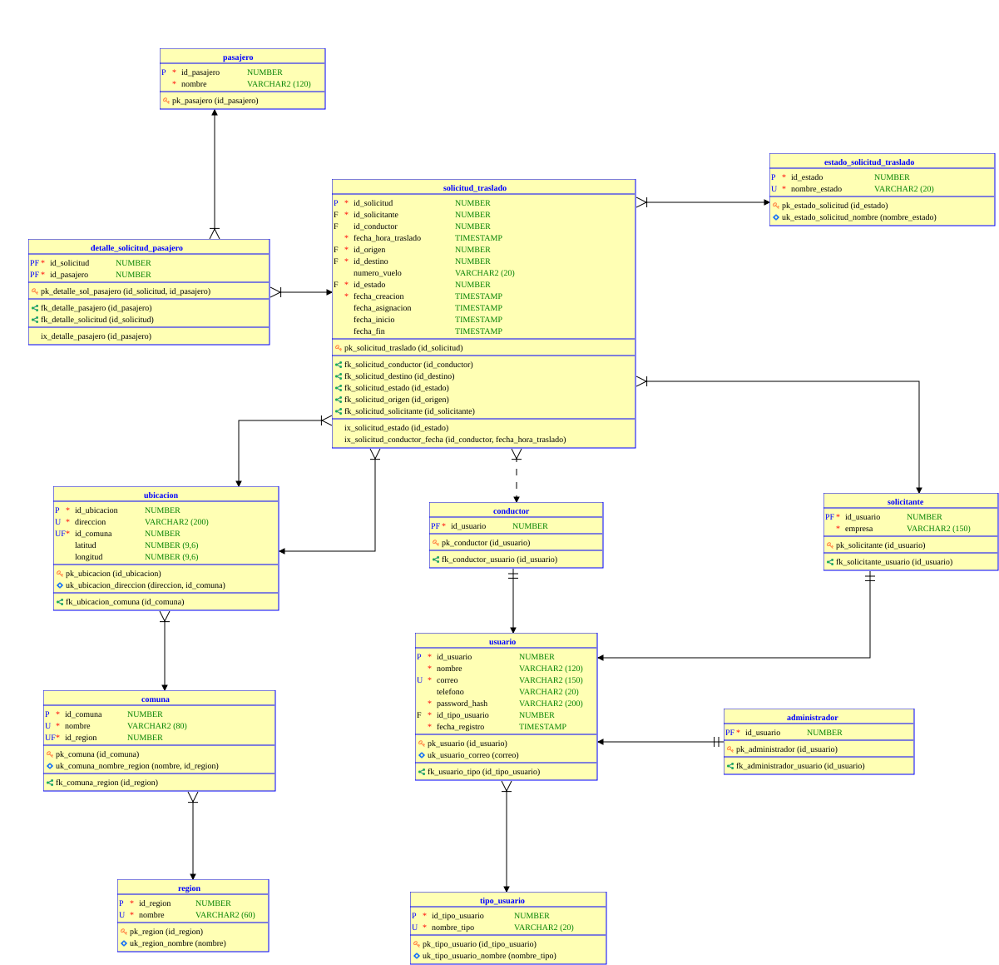
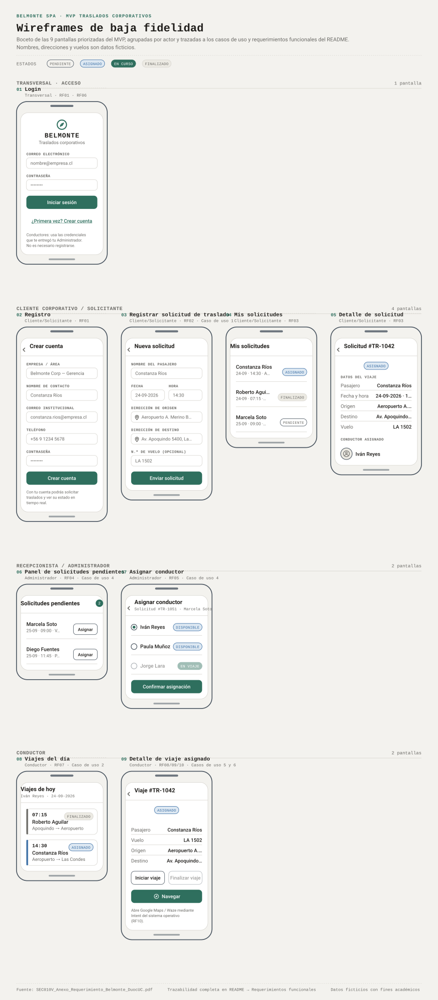

https://github.com/Nokeporro/belmonteSpAtransporte/tree/main# BelmonteSpAtransporte

**Ultima modificacion:** 26-09-2026

## Integrantes:
* Daniel Muñoz
* Michel Sanhueza

## Indice

## Introduccion

Belmonte SpA es una empresa del rubro de transporte privado corporativo, enfocada en traslados ejecutivos y trayectos hacia/desde aeropuertos. Actualmente toda su gestión operativa es manual: las solicitudes de viaje se coordinan de forma dispersa por llamadas telefónicas, correos electrónicos y WhatsApp, transmitiendo de manera informal datos como direcciones, números de vuelo, nombres de pasajeros, fechas y horarios.

Este proyecto busca desarrollar un Producto Mínimo Viable (MVP) de aplicación móvil que automatice y centralice el flujo completo de traslados en una plataforma unificada, integrando la captura de solicitudes, la asignación de viajes a conductores y el enlace directo con aplicaciones de navegación externa (Google Maps / Waze) para el trazado de rutas.

### Descripcion de la problematica

La dispersión de la información en múltiples canales informales genera:
- Ineficiencias logísticas y lentitud en los tiempos de respuesta.
- Riesgo de errores en datos críticos (horarios mal informados, direcciones incorrectas).
- Retrasos en que los conductores reciban sus rutas asignadas.
- Lentitud en la confirmación del servicio de cara al cliente.

El objetivo del proyecto es eliminar la pérdida de información por canales informales, lograr una confirmación de solicitudes ágil y reducir el error manual al despachar rutas a los choferes.

### Actores involucrados

- **Cliente corporativo / Solicitante:** Empresa o persona (ej. asistente, área de RRHH) que agenda el traslado ingresando el formulario con los datos del viaje (fecha, hora, origen, destino, número de vuelo si aplica) y los datos del pasajero.
- **Pasajero:** Persona que efectivamente realiza el traslado; puede coincidir o no con quien lo solicitó.
- **Recepcionista / Administrador:** Encargado de tomar y distribuir las solicitudes de traslado entre los conductores disponibles.
- **Conductor:** Ejecuta el transporte en terreno; visualiza en tiempo real los viajes que tiene asignados para el día y utiliza la app para trazar la ruta en navegadores externos.
- **Sistema de navegación externo (Google Maps / Waze):** Actor externo que recibe las coordenadas georreferenciadas de origen y destino, y genera el trazado de ruta óptima al ser invocado por el conductor mediante Intents del sistema operativo.

### Casos de uso

1. **Registrar solicitud de traslado** (Cliente corporativo/Solicitante): completar un formulario digital con los datos del pasajero, fecha, hora, punto de origen, punto de destino y número de vuelo (si aplica).
2. **Visualizar viajes asignados** (Conductor): ver en tiempo real la lista de viajes asignados para el día.
3. **Navegar a la ruta del viaje** (Conductor): presionar un botón que levante, mediante Intents del sistema operativo, una app externa de navegación (Google Maps / Waze) con el origen y destino georreferenciados.
4. **Gestionar y distribuir solicitudes** (Recepcionista/Administrador): recibir las solicitudes ingresadas y asignarlas a un conductor.
5. **Actualizar estado del traslado** (Recepcionista/Administrador asigna Pendiente → Asignado; Conductor marca En Curso y Finalizado desde terreno): reflejar el ciclo de vida del viaje según los estados Pendiente, Asignado, En Curso y Finalizado.
6. **Trazar ruta óptima hacia el destino** (Sistema de navegación externo): a partir de las coordenadas georreferenciadas de origen y destino recibidas al ser invocado por el conductor, calcular y mostrar la ruta óptima de tráfico.
7.  **Registrar conductor** (Recepcionista/Administrador): crear una cuenta de Conductor ingresando sus datos y credenciales de acceso, sin que el propio conductor se autorregistre.
8.  **Cancelar solicitud de traslado** (Cliente corporativo/Solicitante): cancelar un viaje que ya registró, siempre que todavía no haya comenzado (no está "En Curso" ni "Finalizado").

## Requerimientos funcionales

- **RF01:** El sistema debe permitir al Cliente corporativo/Solicitante registrarse y autenticarse en la aplicación.
- **RF02:** El sistema debe permitir al Cliente corporativo/Solicitante registrar una solicitud de traslado indicando datos del pasajero, fecha, hora, dirección de origen, dirección de destino (seleccionadas mediante autocompletado de Google Places, capturando sus coordenadas georreferenciadas) y número de vuelo (si aplica).
- **RF03:** El sistema debe permitir al Cliente corporativo/Solicitante visualizar el historial y estado de sus solicitudes de traslado.
- **RF04:** El sistema debe permitir al Recepcionista/Administrador visualizar las solicitudes pendientes de asignación.
- **RF05:** El sistema debe permitir al Recepcionista/Administrador asignar un conductor disponible a una solicitud de traslado, actualizando su estado a "Asignado".
- **RF06:** El sistema debe permitir al Conductor autenticarse mediante credenciales asignadas por el Administrador, sin permitir autorregistro.
- **RF07:** El sistema debe permitir al Conductor visualizar en tiempo real los viajes asignados para el día.
- **RF08:** El sistema debe permitir al Conductor visualizar el detalle de un viaje asignado (datos del pasajero, dirección de origen y de destino).
- **RF09:** El sistema debe permitir al Conductor actualizar el estado de un traslado a "En Curso" y a "Finalizado".
- **RF10:** El sistema debe integrar, mediante Intents del sistema operativo Android, una aplicación externa de navegación (Google Maps/Waze) para trazar la ruta hacia el destino a partir de las coordenadas georreferenciadas.
- **RF11:** El sistema debe persistir localmente (Room/SQLite) las solicitudes y viajes ya consultados, permitiendo su visualización sin conexión a internet. Los cambios generados sin conexión (por ejemplo, un cambio de estado registrado por el Conductor en terreno) deben quedar en una cola local y sincronizarse automáticamente con el backend vía API REST al recuperar la conectividad.
- **RF12:** El sistema debe notificar mediante mensajería push (Firebase Cloud Messaging) a los actores afectados cuando ocurra un cambio relevante en una solicitud de traslado (asignación de conductor, cambio de estado a En Curso o Finalizado), de modo que la información se actualice sin que el usuario tenga que recargar la app manualmente.
- **RF13:** El sistema debe registrar y mantener actualizado el token de notificación push (FCM) de cada usuario autenticado, para poder enviarle notificaciones dirigidas.
- **RF14:** El sistema debe permitir al Recepcionista/Administrador registrar una cuenta de Conductor (nombre, correo, teléfono y contraseña inicial), quedando disponible de inmediato para autenticarse e iniciar sesión.
- **RF15:** El sistema debe permitir al Cliente corporativo/Solicitante cancelar una solicitud de traslado propia mientras su estado sea "Pendiente" o "Asignado". Si la solicitud ya tenía un conductor asignado, el sistema debe notificarle la cancelación mediante push (FCM).

## Historias de usuario

- **HU01:** Como Cliente corporativo/Solicitante, quiero registrarme y autenticarme en la aplicación, para acceder de forma segura a mis solicitudes de traslado. (RF01)
- **HU02:** Como Cliente corporativo/Solicitante, quiero registrar una solicitud de traslado con los datos del pasajero, fecha, hora, origen, destino y número de vuelo, para coordinar el viaje sin depender de llamadas o WhatsApp. (RF02)
- **HU03:** Como Cliente corporativo/Solicitante, quiero ver el historial y el estado de mis solicitudes de traslado, para saber en todo momento si mi viaje ya fue asignado. (RF03)
- **HU04:** Como Recepcionista/Administrador, quiero visualizar las solicitudes pendientes de asignación, para distribuirlas rápidamente entre los conductores disponibles. (RF04)
- **HU05:** Como Recepcionista/Administrador, quiero asignar un conductor disponible a una solicitud de traslado, para confirmar el viaje y actualizar su estado a Asignado. Criterios de aceptación adicionales: la vista "Asignar conductor" también funciona sobre una solicitud en estado Asignado, permitiendo reemplazar al conductor previamente elegido (por ejemplo, si tuvo un imprevisto). Al reasignar, el estado permanece en "Asignado" (no vuelve a Pendiente), se actualiza id_conductor y fecha_asignacion, y el conductor anterior recibe una notificación push informando que ya no tiene ese viaje, mientras el nuevo conductor recibe la notificación de asignación (RF12). (RF05)
- **HU06:** Como Conductor, quiero autenticarme con las credenciales que me entrega el Administrador, para acceder a mis viajes sin tener que registrarme yo mismo. (RF06)
- **HU07:** Como Conductor, quiero visualizar en tiempo real los viajes que tengo asignados para el día, para organizar mi jornada de traslados. (RF07)
- **HU08:** Como Conductor, quiero ver el detalle de un viaje asignado (pasajero, origen y destino), para confirmar los datos antes de iniciar el traslado. (RF08)
- **HU09:** Como Conductor, quiero actualizar el estado de un traslado a En Curso y a Finalizado, para reflejar el avance real del viaje. (RF09)
- **HU10:** Como Conductor, quiero abrir la ruta del viaje directamente en Google Maps o Waze desde la app, para no tener que copiar direcciones manualmente y llegar más rápido. (RF10)
- **HU11:** Como Conductor, quiero que la app guarde mis datos localmente y los sincronice con el backend, para no perder información si la conexión a internet se interrumpe momentáneamente en terreno. (RF11)
- **HU12:** Como Recepcionista/Administrador, quiero que los cambios de estado de los traslados se reflejen en tiempo real para todos los actores conectados, para tener visibilidad inmediata de la operación sin depender de reportes manuales. (RF12)

## Backlog

| ID | Historia de usuario | Criterios de aceptación | Prioridad | Estimación (SP) |
|----|---|---|---|---|
| HU01 | Registro y login del Cliente corporativo/Solicitante | El registro se rechaza si el correo ya existe o falta algún campo obligatorio (empresa, contacto, correo, teléfono, contraseña). Con credenciales válidas se accede a "Mis solicitudes"; con credenciales inválidas se muestra un error sin indicar cuál dato falló. | Alta | 3 |
| HU02 | Registrar solicitud de traslado | El campo de origen y destino usa autocompletado (Google Places API): el Solicitante escribe y elige una dirección de una lista de sugerencias, nunca texto libre. Al seleccionar una dirección, la app captura automáticamente latitud y longitud junto con el texto. No se puede enviar el formulario si origen o destino no fueron seleccionados de la lista (evita direcciones sin coordenadas). El número de vuelo es opcional; pasajero, fecha, hora, origen y destino son obligatorios.| Alta | 5 |
| HU03 | Ver historial y estado de mis solicitudes | La lista muestra pasajero, fecha/hora, ruta (origen→destino) y estado de cada solicitud propia. El estado reflejado corresponde al último cambio registrado por el Administrador o el Conductor. | Media | 3 |
| HU04 | Panel de solicitudes pendientes | Solo se listan solicitudes en estado Pendiente. Cada fila permite pasar directamente a la vista "Asignar conductor" de esa solicitud. | Alta | 3 |
| HU05 | Asignar conductor a una solicitud | Solo se listan conductores disponibles (sin viaje en curso). Al confirmar, la solicitud pasa a estado Asignado y queda visible en "Viajes del día" del conductor elegido. | Alta | 5 |
| HU06 | Login del Conductor (sin autorregistro) | La pantalla de login del Conductor no ofrece la opción "crear cuenta". Con credenciales inválidas se muestra un error sin revelar si el correo existe. | Alta | 2 |
| HU07 | Ver viajes del día | Solo se muestran los viajes del conductor autenticado, para la fecha actual, ordenados por hora. Cada viaje muestra pasajero, hora y estado. | Alta | 3 |
| HU08 | Ver detalle de un viaje asignado | Muestra pasajero, número de vuelo (si aplica), origen y destino completos. Incluye el botón "Navegar" y los controles de cambio de estado. | Alta | 3 |
| HU09 | Actualizar estado del viaje (En Curso / Finalizado) | "Iniciar viaje" solo está habilitado si el estado actual es Asignado. "Finalizar viaje" solo está habilitado si el estado actual es En Curso. Cada cambio de estado registra la fecha/hora en que ocurrió. | Alta | 3 |
| HU10 | Navegar con Google Maps/Waze | Al presionar "Navegar" se abre Google Maps o Waze con el destino precargado. Si no hay ninguna app de navegación instalada, se muestra un aviso en vez de fallar silenciosamente. | Alta | 3 |
| HU11 | Persistencia local y sincronización | Las solicitudes y viajes ya cargados se pueden seguir consultando sin conexión.
Un cambio de estado hecho sin conexión (ej. "Finalizar viaje") se guarda en una cola local y se marca como "pendiente de sincronizar".
Al recuperar la conexión, la cola se envía automáticamente al backend sin intervención del usuario. | Media | 8 |
| HU12 | Recibir notificación al cambiar el estado de mi traslado | Como Solicitante, cuando mi traslado pasa a "Asignado", "En Curso" o "Finalizado", recibo una notificación push.
Al abrir la notificación (o la pantalla "Mis solicitudes"), el estado mostrado ya está actualizado sin necesidad de recargar manualmente. | Media | 5 |
| HU13 | Recibir notificación de un nuevo viaje asignado| Como Conductor, cuando el Administrador me asigna una solicitud, recibo una notificación push.
Al abrirla, el viaje aparece en "Viajes del día" con sus datos completos. | Alta | 5 |
| HU14 | Registro del token de notificaciones|Como usuario autenticado (Solicitante, Administrador o Conductor), al iniciar sesión la app registra o actualiza mi token FCM en el backend.
Si el token cambia (reinstalación, cambio de dispositivo), se reemplaza el anterior sin duplicar registros.| Alta | 3 |
| HU15 |Registrar conductor|Como Administrador, quiero crear una cuenta de Conductor con nombre, correo, teléfono y contraseña, para que pueda autenticarse sin autorregistrarse.
Criterios: el registro se rechaza si el correo ya existe o falta un campo obligatorio.
El Administrador define la contraseña directamente en el formulario (no se genera automáticamente).
La contraseña se guarda como hash (password_hash), nunca en texto plano.
Al crearse, el conductor queda disponible de inmediato en "Asignar conductor" (HU05).
No existe una vista de "cambiar contraseña" para el Conductor: si necesita una nueva, el Administrador la reemplaza directamente en su ficha.| Alta | 3 |
| HU16 |Cancelar solicitud de traslado|Como Solicitante, quiero cancelar un traslado que ya no necesito, para liberar al conductor y que no se presente a un viaje que no va a ocurrir.
Criterios: el botón "Cancelar" solo está disponible si el estado es Pendiente o Asignado.
Si el estado es En Curso o Finalizado, no se puede cancelar.
Al cancelar, el estado pasa a "Cancelado" y queda registrada la fecha/hora de cancelación.
Si la solicitud tenía conductor asignado, este recibe una notificación push de la cancelación (mismo mecanismo de RF12) y el viaje desaparece de su lista "Viajes del día".| Alta | 3 |

## Modelamiento del problema

Script DDL (Oracle XE 21c): [datamodeler/schema.sql](datamodeler/schema.sql)

| Entidad | Atributo | Tipo de dato | Clave | Descripción |
|---|---|---|---|---|
| REGION | id_region | NUMBER | PK | Identificador de la región. |
| REGION | nombre | VARCHAR2(60) | UNIQUE, NOT NULL | Nombre de la región. |
| COMUNA | id_comuna | NUMBER | PK | Identificador de la comuna. |
| COMUNA | nombre | VARCHAR2(80) | NOT NULL (UNIQUE junto a id_region) | Nombre de la comuna. |
| COMUNA | id_region | NUMBER | FK → REGION, NOT NULL | Región a la que pertenece. |
| UBICACION | id_ubicacion | NUMBER | PK | Identificador de la ubicación. |
| UBICACION | direccion | VARCHAR2(200) | NOT NULL (UNIQUE junto a id_comuna) | Dirección georreferenciada (RF10). |
| UBICACION | id_comuna | NUMBER | FK → COMUNA, NOT NULL | Comuna de la dirección. |
| UBICACION | latitud | NUMBER(9,6) | — | Coordenada geográfica (RF10). |
| UBICACION | longitud | NUMBER(9,6) | — | Coordenada geográfica (RF10). |
| TIPO_USUARIO | id_tipo_usuario | NUMBER | PK | Identificador del rol. |
| TIPO_USUARIO | nombre_tipo | VARCHAR2(20) | UNIQUE, NOT NULL | SOLICITANTE, ADMINISTRADOR o CONDUCTOR. |
| USUARIO | id_usuario | NUMBER | PK | Identificador de la cuenta. |
| USUARIO | nombre | VARCHAR2(120) | NOT NULL | Nombre del usuario. |
| USUARIO | correo | VARCHAR2(150) | UNIQUE, NOT NULL | Correo de acceso (login). |
| USUARIO | telefono | VARCHAR2(20) | — | Teléfono de contacto. |
| USUARIO | password_hash | VARCHAR2(200) | NOT NULL | Hash de la contraseña. |
| USUARIO | id_tipo_usuario | NUMBER | FK → TIPO_USUARIO, NOT NULL | Rol de la cuenta. |
| USUARIO | fecha_registro | TIMESTAMP | NOT NULL, DEFAULT SYSTIMESTAMP | Fecha de creación de la cuenta. |
| SOLICITANTE | id_usuario | NUMBER | PK, FK → USUARIO | Extensión 1:1 del Cliente corporativo/Solicitante. |
| SOLICITANTE | empresa | VARCHAR2(150) | NOT NULL | Empresa o área que agenda los traslados (RF01). |
| ADMINISTRADOR | id_usuario | NUMBER | PK, FK → USUARIO | Extensión 1:1 del Recepcionista/Administrador (sin atributos propios aún). |
| CONDUCTOR | id_usuario | NUMBER | PK, FK → USUARIO | Extensión 1:1 del Conductor (sin atributos propios aún). |
| PASAJERO | id_pasajero | NUMBER | PK | Identificador del pasajero. |
| PASAJERO | nombre | VARCHAR2(120) | NOT NULL | Nombre de la persona transportada. |
| ESTADO_SOLICITUD_TRASLADO | id_estado | NUMBER | PK | Identificador del estado. |
| ESTADO_SOLICITUD_TRASLADO | nombre_estado | VARCHAR2(20) | UNIQUE, NOT NULL | PENDIENTE, ASIGNADO, EN_CURSO o FINALIZADO. |
| SOLICITUD_TRASLADO | id_solicitud | NUMBER | PK | Identificador de la solicitud. |
| SOLICITUD_TRASLADO | id_solicitante | NUMBER | FK → SOLICITANTE, NOT NULL | Quién agenda el traslado. |
| SOLICITUD_TRASLADO | id_conductor | NUMBER | FK → CONDUCTOR | NULL hasta que el Administrador asigna un conductor (RF05). |
| SOLICITUD_TRASLADO | fecha_hora_traslado | TIMESTAMP | NOT NULL | Fecha y hora del traslado. |
| SOLICITUD_TRASLADO | id_origen | NUMBER | FK → UBICACION, NOT NULL | Dirección de origen. |
| SOLICITUD_TRASLADO | id_destino | NUMBER | FK → UBICACION, NOT NULL | Dirección de destino. |
| SOLICITUD_TRASLADO | numero_vuelo | VARCHAR2(20) | — | Opcional; solo si aplica a un vuelo. |
| SOLICITUD_TRASLADO | id_estado | NUMBER | FK → ESTADO_SOLICITUD_TRASLADO, NOT NULL | Ciclo de vida del traslado (RF05/RF09). |
| SOLICITUD_TRASLADO | fecha_creacion | TIMESTAMP | NOT NULL, DEFAULT SYSTIMESTAMP | Momento en que se registró la solicitud. |
| SOLICITUD_TRASLADO | fecha_asignacion | TIMESTAMP | — | Momento en que se asignó un conductor. |
| SOLICITUD_TRASLADO | fecha_inicio | TIMESTAMP | — | Momento en que el viaje pasó a En Curso. |
| SOLICITUD_TRASLADO | fecha_fin | TIMESTAMP | — | Momento en que el viaje se marcó Finalizado. |
| DETALLE_SOLICITUD_PASAJERO | id_solicitud | NUMBER | PK, FK → SOLICITUD_TRASLADO | Traslado en el que viaja el pasajero. |
| DETALLE_SOLICITUD_PASAJERO | id_pasajero | NUMBER | PK, FK → PASAJERO | Pasajero que viaja en ese traslado. |

El "Sistema de navegación externo" no tiene tabla: es un actor externo sin datos propios que persistir.

Normalizado a 3FN:
- `UBICACION` separada de `SOLICITUD_TRASLADO`: latitud/longitud dependen funcionalmente de la dirección, no de la solicitud (dependencia transitiva).
- `PASAJERO` + `DETALLE_SOLICITUD_PASAJERO` separados de `SOLICITUD_TRASLADO`: una columna única `nombre_pasajero` sería un grupo repetitivo en cuanto hay más de un pasajero por viaje (viola 1FN).
- `TIPO_USUARIO` y `ESTADO_SOLICITUD_TRASLADO` pasan de `CHECK` a catálogo: no corrige una forma normal, pero permite agregar/renombrar valores sin alterar el DDL de las tablas que los usan.
- `COMUNA`/`REGION`: `direccion` es `UNIQUE` en `UBICACION` (llave candidata), por lo que `id_ubicacion → direccion → id_comuna` no viola 3FN; es una descomposición normal de jerarquía geográfica, no una corrección de anomalía.

### Modelo logico
### Modelo relacional

## Arquitectura

### Base de datos
**MariaDB**

* **Integridad Transaccional (ACID):** Utiliza el motor de almacenamiento `InnoDB`, garantizando la consistencia y atomicidad de los datos en procesos críticos de logística (como la asignación de vehículos, registro de mantenimientos y estados de viaje).
* **Compatibilidad Total con el Ecosistema Spring:** Cuenta con dialectos oficiales en Hibernate (`MariaDBDialect`) y un driver JDBC oficial (`mariadb-java-client`) ligero y eficiente, permitiendo la generación y migración automática de tablas desde Java.
* **Filosofía Open Source:** Es un sistema de gestión de bases de datos 100% libre y comunitario (Licencia GPL v2), asegurando estabilidad sin depender de licencias comerciales.
* **Eficiencia de Recursos en Desarrollo:** Presenta un consumo optimizado de memoria y CPU en entornos de desarrollo local, permitiendo ejecutar simultáneamente el entorno de Android Studio, la base de datos y la API de Spring Boot sin sobrecargar el equipo.
### Backend
**Spring Boot** como el framework principal para la capa del backend debido a las siguientes ventajas técnicas:

* **Arquitectura REST Nativa para Clientes Móviles:** Permite estructurar y exponer endpoints HTTP en formato JSON estandarizado. Esto facilita la integración transparente con la aplicación móvil Android utilizando librerías de red como Retrofit o Volley.
* **Seguridad Stateless mediante JWT:** A través de **Spring Security**, la aplicación implementa autenticación basada en tokens **JWT (JSON Web Tokens)**. Al ser una API sin estado (*stateless*), es el enfoque óptimo para dispositivos móviles, permitiendo un control de acceso seguro y basado en roles (ej. Administrador, Chofer).
* **Diseño Modular y Separación de Capas:** Impone un patrón de diseño claro (`Controller` ➔ `Service` ➔ `Repository`), lo que garantiza un código limpio, mantenible, fácil de auditar y preparado para futuras ampliaciones de lógica de negocio.
* **Productividad con Spring Data JPA:** Automatiza la persistencia de datos mediante el mapeo objeto-relacional (ORM), eliminando la necesidad de escribir código SQL manual redundante para las operaciones estándar (CRUD).
### Frontend

Vistas propuestas para el MVP, agrupadas por actor:

**Transversal**
- **Login:** autenticación para los tres actores con app móvil (Cliente corporativo/Solicitante, Recepcionista/Administrador, Conductor).
- **Perfil / Cierre de sesión:** datos del usuario logueado.

**Cliente corporativo / Solicitante**
- **Registro:** creación de cuenta propia. El Conductor no se autorregistra: sus credenciales son asignadas por el Administrador, por lo que solo usa la vista de Login.
- **Registrar solicitud de traslado:** formulario con datos del pasajero, fecha, hora, origen, destino y n.º de vuelo (si aplica). Cubre el caso de uso 1.
- **Mis solicitudes (historial):** lista de traslados agendados con su estado actual (Pendiente/Asignado/En Curso/Finalizado).
- **Detalle de solicitud:** vista de una solicitud puntual con los datos ingresados, estado, y datos del conductor una vez asignado.

**Recepcionista / Administrador**
- **Panel de solicitudes pendientes:** listado de solicitudes sin asignar. Entrada al caso de uso 4.
- **Asignar conductor:** vista para elegir un conductor disponible para una solicitud puntual. Cubre el caso de uso 4.
- **Panel general / dashboard** *(segunda iteración)*: resumen operativo con conteo de viajes por estado.

**Conductor**
- **Viajes del día:** lista de viajes asignados para la fecha actual, ordenados por hora. Cubre el caso de uso 2.
- **Detalle de viaje asignado:** datos del pasajero, origen, destino, control para marcar "En Curso"/"Finalizado" y botón que dispara el Intent hacia Google Maps/Waze. Cubre los casos de uso 5 y 6.
- **Historial de viajes realizados** *(segunda iteración)*: viajes ya finalizados por el conductor.
