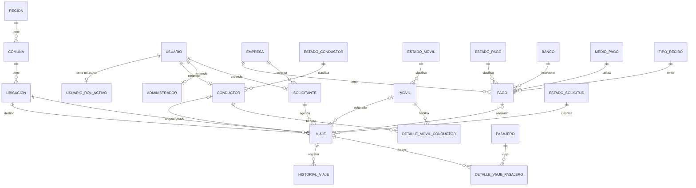

# Aplicacion de Belmonte Spa.
## Especificaciones del proyecto.

**Ultima modificacion:** 18-10-2026

## Integrantes:
* Daniel Muñoz
* Michel Sanhueza

## Indice

- [Introduccion](#introduccion)
  - [Problemática y actores](#problemática-y-actores)
- [Máquinas de estado](#máquinas-de-estado)
- [Requisitos](#requisitos)
  - [Casos de uso](#casos-de-uso)
  - [Requerimientos funcionales](#requerimientos-funcionales)
  - [Requisitos no funcionales](#requisitos-no-funcionales)
  - [Historias de usuario y Backlog](#historias-de-usuario-y-backlog)
- [Modelamiento del problema](#modelamiento-del-problema)
  - [Modelo de datos](#modelo-de-datos)
  - [Decisiones de modelo](#decisiones-de-modelo)
  - [Modelo relacional](#modelo-relacional)
- [Arquitectura](#arquitectura)
  - [Stack](#stack)
  - [Servicios locales](#servicios-locales)
- [API REST](#api-rest)
  - [Convenciones](#convenciones)
  - [Recursos y roles](#recursos-y-roles)
  - [Consultas y alcance por rol](#consultas-y-alcance-por-rol)
  - [Flujo de una solicitud (CU-01 / RF02)](#flujo-de-una-solicitud-cu-01--rf02)
  - [Acciones de negocio](#acciones-de-negocio)
  - [Autenticación](#autenticación)
  - [Errores](#errores)
- [Estructura del backend](#estructura-del-backend)
  - [Paquetes y capas](#paquetes-y-capas)
  - [Persistencia MariaDB](#persistencia-mariadb)
  - [Configuración](#configuración)
  - [Notificaciones externas](#notificaciones-externas)
  - [Pruebas](#pruebas)
- [Frontend (Android)](#frontend-android)
  - [Arquitectura y responsabilidades](#arquitectura-y-responsabilidades)
  - [Tecnologías](#tecnologías)
  - [Organización del código](#organización-del-código)
  - [Navegación y pantallas](#navegación-y-pantallas)
  - [API y sesión](#api-y-sesión)
  - [Persistencia y conectividad](#persistencia-y-conectividad)
  - [Base de datos local](#base-de-datos-local)
  - [Notificaciones y navegación externa](#notificaciones-y-navegación-externa)
  - [Entornos y compilación](#entornos-y-compilación)
  - [Pruebas Android](#pruebas-android)
  - [Decisiones abiertas](#decisiones-abiertas)

## Introduccion

Especificación de referencia del proyecto: requisitos, arquitectura, contratos y
tecnologías. No registra el avance de implementación ni certifica que el código cumpla lo
descrito; su revisión evalúa la coherencia y suficiencia de la especificación, y la
conformidad del código se revisa aparte.

Belmonte SpA hace transporte privado corporativo (traslados ejecutivos y aeropuerto). El MVP
móvil centraliza el flujo: captura de solicitudes, asignación a conductores y enlace con
navegación externa (Google Maps/Waze).

### Problemática y actores

Hoy las solicitudes se coordinan a mano (teléfono, correo, WhatsApp): datos críticos
erróneos (horarios, direcciones), respuestas lentas y retraso en que el conductor reciba su ruta.

| ID | Actor | Rol |
|---|---|---|
| ACT-01 | Cliente corporativo / Solicitante | Agenda el traslado (datos del viaje y del pasajero). |
| ACT-02 | Pasajero | Quien viaja; puede no ser el solicitante. |
| ACT-03 | Recepcionista / Administrador | Asigna solicitudes a conductores; gestiona flota (vehículos y habilitaciones) y pagos. |
| ACT-04 | Conductor | Ejecuta el traslado; ve sus viajes del día y abre la ruta en un navegador externo. |
| ACT-05 | Sistema de navegación externo (Google Maps / Waze) | Recibe las coordenadas por Intent y traza la ruta. Sin tabla: no hay datos propios que persistir. |

El Anexo de Requerimiento (§2.4) agrupa Solicitante y Pasajero; aquí se separan porque el
Pasajero no pertenece necesariamente a la empresa que paga (`PASAJERO` no tiene FK a
`EMPRESA`) y el Solicitante puede no viajar.

## Máquinas de estado

Fuente única de las transiciones; los CU, RF, HU y la API remiten aquí. Toda transición
inválida responde 409 y los triggers de `db/migration` la vuelven a validar.

### Viaje

`ESTADO_SOLICITUD`: `PENDIENTE → ASIGNADO → EN_CURSO → FINALIZADO`, más `CANCELADO` desde
`PENDIENTE` o `ASIGNADO`. Sin retroceso ni reapertura; `EN_CURSO` y `FINALIZADO` no se
cancelan ni se reasignan. Cada cambio registra su fecha/hora.

| ID | Transición | Quién | Precondiciones | Efectos |
|---|---|---|---|---|
| V1 | alta → `PENDIENTE` | Solicitante (CU-01/RF02) | `fh_agenda` futura | El backend genera el `folio` (inmutable); `fh_creacion`. |
| V2 | `PENDIENTE`/`ASIGNADO` → `ASIGNADO` (asignar o reasignar) | Administrador (CU-04/RF05/RF22) | Conductor y vehículo Disponibles (sin otro viaje `EN_CURSO`); conductor habilitado para el vehículo; pasajeros ≤ capacidad. Al reasignar, la disponibilidad se valida solo para lo que cambia y la habilitación para el par resultante. Sin reasignación automática. | `fh_asignacion`. No cambia el estado del conductor ni del vehículo: ambos pueden tener varios viajes `ASIGNADO`. Al reasignar puede cambiar solo el conductor, solo el vehículo o ambos; el viaje sale de la agenda de los reemplazados. Push al conductor (nuevo), al solicitante y, si cambia el conductor, al reemplazado. |
| V3 | `ASIGNADO` → `EN_CURSO` | Conductor asignado (RF09) | Conductor y vehículo Disponibles (sin otro viaje `EN_CURSO`). | `fh_inicio`; conductor → Ocupado, vehículo → En uso. Push al solicitante. |
| V4 | `EN_CURSO` → `FINALIZADO` | Conductor asignado (RF09) | — | `fh_fin`; conductor y vehículo → Disponible. Push al solicitante. |
| V5 | `PENDIENTE`/`ASIGNADO` → `CANCELADO` (cancelar) | Solicitante dueño (CU-08/RF15) | — | Si había conductor: push al conductor y el viaje sale de su agenda ("Viajes del día" si es de hoy). No cambia el estado de conductor ni vehículo (en `PENDIENTE`/`ASIGNADO` este viaje no los ocupa). Pago `PAGADO` → `REEMBOLSADO` (P4; se devuelve el 50 % de su monto); en otro estado el pago no cambia. No modifica `fh_fin`: el momento queda en `HISTORIAL_VIAJE`. |
| V6 | `PENDIENTE`/`ASIGNADO` → `CANCELADO` (por anulación del pago) | Sistema, al anular el Administrador el pago (P2 o P3; CU-12/RF19) | — | Mismos efectos de V5 (agenda y push al conductor), sin devolución del 50 %. |

`CANCELADO` se suma a los 4 estados del Anexo (§3.2) para conservar la auditoría: la
solicitud no se borra.

### Pago

`ESTADO_PAGO`. Relación 1:1 con el viaje: un viaje tiene a lo más un pago y un pago pertenece a un solo viaje.

| ID | Desde | Hacia | Quién / cómo |
|---|---|---|---|
| P1 | alta | `PENDIENTE` | Administrador (CU-11/RF18), para un viaje en cualquier estado distinto de `CANCELADO`; el backend genera su `hash` (único). |
| P2 | `PENDIENTE` | `PAGADO`, `RECHAZADO` o `ANULADO` | Manual, Administrador (CU-12/RF19). Al pasar a `PAGADO`, el backend fija `fecha_pago`. |
| P3 | `PAGADO` | `ANULADO` | Manual, Administrador. |
| P4 | `PAGADO` | `REEMBOLSADO` | Automático en V5, cuando el Solicitante cancela el viaje (CU-08/RF15); nunca manual. |

- `RECHAZADO`, `ANULADO` y `REEMBOLSADO` son terminales.
- `ANULADO` por P2 o P3 (problema con el banco u otro motivo) cancela el viaje si está `PENDIENTE` o `ASIGNADO` (V6).
- Sin re-cobro: el pago no se reemplaza ni se registra otro. Un viaje con su pago `RECHAZADO`, o
  `ANULADO` estando `EN_CURSO` o `FINALIZADO`, queda sin cobro (`POST /pagos` responde 409 porque ya tiene pago).

### Conductor y vehículo

- **Conductor** (`ESTADO_CONDUCTOR`): nace Disponible (CU-07); Ocupado solo mientras tiene un
  viaje `EN_CURSO` (de V3 a V4).
- **Vehículo** (`ESTADO_MOVIL`): nace Disponible (CU-09); En uso solo mientras tiene un viaje
  `EN_CURSO` (de V3 a V4).
- Disponible = sin viaje `EN_CURSO`. Asignar (V2) no cambia estos estados: ambos pueden tener
  varios viajes `ASIGNADO` (su agenda), pero a lo más uno `EN_CURSO`.

## Requisitos

### Casos de uso

| CU | Actor | Flujo | Excepciones |
|---|---|---|---|
| CU-01 Registrar solicitud de traslado | ACT-01 | Ingresa pasajero(s), fecha/hora, origen, destino y n.º de vuelo (si aplica) → viaje `PENDIENTE` con sus pasajeros, en tres llamadas ([Flujo de una solicitud](#flujo-de-una-solicitud-cu-01--rf02)). | Datos incompletos o inválidos; las reglas de validación no están definidas en el alcance actual. |
| CU-02 Visualizar viajes asignados | ACT-04 | Lista sus viajes asignados del día, actualizados desde el backend. | Sin conectividad: muestra los viajes ya sincronizados (RF11/HU11). Sin viajes: lista vacía. |
| CU-03 Navegar a la ruta del viaje | ACT-04 | "Navegar" en un viaje con coordenadas → Intent con origen y destino → el SO lo entrega a una app compatible, que navega. | No hay app compatible o el Intent no puede procesarse. |
| CU-04 Gestionar y distribuir solicitudes | ACT-03 | Elige una solicitud y un conductor disponible (se sugieren sus vehículos habilitados) y confirma: [V2](#viaje) `PENDIENTE` → `ASIGNADO`. | Sin conductores disponibles. Sin reasignación automática; la manual de un `ASIGNADO` sigue el mismo flujo (RF22). |
| CU-05 Actualizar estado del traslado | ACT-03, ACT-04 | Ciclo [V2](#viaje) `PENDIENTE` → `ASIGNADO` (el Administrador asigna), [V3](#viaje) `ASIGNADO` → `EN_CURSO` y [V4](#viaje) `EN_CURSO` → `FINALIZADO` (el Conductor inicia y finaliza). | Sin retroceso ni reapertura; la cancelación es CU-08 (o la anulación del pago, CU-12). |
| CU-06 Trazar ruta óptima hacia el destino | ACT-05 | Con coordenadas válidas, calcula la ruta con el tráfico disponible y la muestra al conductor. | Algoritmo, proveedor de tráfico y criterios son del sistema externo. |
| CU-07 Registrar conductor | ACT-03 | El Administrador ingresa nombre, correo (único), contraseña inicial (se guarda como hash) y teléfono opcional; la cuenta queda activa para autenticarse y, una vez habilitada para un vehículo (CU-10), para ser asignada (CU-04). Sin autorregistro. | Correo existente o campo faltante: rechazo. El Conductor no tiene "cambiar contraseña": el Administrador la reemplaza en su ficha. |
| CU-08 Cancelar solicitud de traslado | ACT-01 | Solicitud propia en `PENDIENTE` o `ASIGNADO`: "Cancelar" en el detalle → [V5](#viaje) `PENDIENTE`/`ASIGNADO` → `CANCELADO`, con fecha/hora. | En `EN_CURSO` o `FINALIZADO` no hay botón y se rechaza. |
| CU-09 Registrar vehículo | ACT-03 | Patente (única), capacidad y serial GPS opcional (el smartphone del conductor también reporta ubicación); queda Disponible, habilitable y asignable. | Patente existente o campo faltante: rechazo. |
| CU-10 Habilitar conductor para vehículo | ACT-03 | Relaciona un conductor (CU-07) con uno o más vehículos (CU-09); M:N. | Relación existente: se ignora sin duplicar. |
| CU-11 Registrar pago de un viaje | ACT-03 | En un viaje no `CANCELADO`: monto, banco, medio de pago y tipo de recibo → pago `PENDIENTE` asociado al viaje. | Viaje `CANCELADO`: no se registra. |
| CU-12 Actualizar estado de un pago | ACT-03 | Sobre un pago `PENDIENTE` (o `PAGADO`, solo para anularlo) marca `PAGADO`, `RECHAZADO` o `ANULADO` ([P2](#pago) desde `PENDIENTE`; [P3](#pago) `PAGADO` → `ANULADO`); anular cancela el viaje `PENDIENTE` o `ASIGNADO` ([V6](#viaje)). | Estado terminal: no cambia. |
| CU-13 Recuperar contraseña | ACT-01, ACT-03 | Ingresa su correo en "Recuperar contraseña". Si es de un Solicitante o Administrador: contraseña temporal aleatoria, guardada hasheada en `password_hash` con `password_temporal_expira` y enviada en texto plano solo a ese correo vía `EmailClient` (único momento en claro; nunca se persiste así, RNF01). Sirve para el login (CU-14) hasta expirar. | Correo inexistente o de un Conductor: mismo mensaje genérico. Expirada sin uso: pedir otra. |
| CU-14 Iniciar sesión | ACT-01, ACT-03, ACT-04 | Cuenta autorregistrada (Solicitante, RF01), creada por el Administrador (Conductor, RF14) o por migración Flyway (Administrador). Envía correo, contraseña y el token FCM si existe (RF13). Se valida contra `USUARIO.password_hash` y se rechaza si `password_temporal_expira` no es nulo y ya pasó (RF21). El rol es la tabla (`SOLICITANTE`/`ADMINISTRADOR`/`CONDUCTOR`) donde existe el `id_usuario`, único por `USUARIO_ROL_ACTIVO`. Se guarda o reemplaza `USUARIO.token_fcm` y se emite un JWT (`sub` = correo, `rol`, `exp`; RNF01) que el cliente adjunta en cada request y que el `SecurityFilterChain` valida aplicando el mapeo rol→endpoint. | Correo inexistente, contraseña incorrecta o temporal expirada: mismo error genérico. |

El Conductor queda fuera de CU-13 a propósito: solo el Administrador reemplaza su contraseña
(CU-07/RF14), para que un desvinculado no recupere acceso por su cuenta.

### Requerimientos funcionales

"Sistema" = requisito sin actor que lo inicie.

| ID | Actor | Requisito |
|---|---|---|
| **RF01** | Solicitante | Registrarse (razón social y RUT de su empresa crean o reutilizan una fila en `EMPRESA`) y autenticarse (CU-14). |
| **RF02** | Solicitante | Registrar una solicitud: pasajero, fecha, hora, origen y destino (autocompletado de Google Places, con coordenadas) y n.º de vuelo si aplica. |
| **RF03** | Solicitante | Ver el historial y estado de sus solicitudes. |
| **RF04** | Administrador | Ver las solicitudes pendientes de asignación. |
| **RF05** | Administrador | Asignar un conductor disponible y un vehículo habilitado para él: la solicitud pasa a Asignado ([V2](#viaje) `PENDIENTE` → `ASIGNADO`); conductor y vehículo pasan a Ocupado/En uso recién al iniciar ([V3](#viaje)). |
| **RF06** | Conductor | Autenticarse con credenciales asignadas por el Administrador, sin autorregistro (CU-14). |
| **RF07** | Conductor | Ver en tiempo real los viajes asignados del día. |
| **RF08** | Conductor | Ver el detalle de un viaje asignado (pasajero, origen, destino). |
| **RF09** | Conductor | Pasar un traslado a En Curso y a Finalizado; al finalizar, conductor y vehículo vuelven a Disponible. |
| **RF10** | Sistema | Abrir por Intents de Android una app de navegación externa (Google Maps/Waze) que trace la ruta desde las coordenadas. |
| **RF11** | Sistema | Persistir localmente (Room/SQLite) solicitudes y viajes ya consultados para verlos sin conexión; los cambios offline (p. ej. de estado) van a una cola local y se sincronizan por API REST al reconectar. |
| **RF12** | Sistema | Push (FCM) a los actores afectados ante cambios relevantes (asignación o reasignación, En Curso, Finalizado, cancelación), sin recarga manual. |
| **RF13** | Sistema | Registrar y mantener actualizado el token FCM de cada usuario autenticado. |
| **RF14** | Administrador | Registrar una cuenta de Conductor (nombre, correo, contraseña inicial; teléfono opcional), utilizable de inmediato. |
| **RF15** | Solicitante | Cancelar una solicitud propia en Pendiente o Asignado: el viaje sale de la agenda del conductor, si había uno, y se le avisa por push; un pago Pagado pasa a Reembolsado con devolución del 50 % ([V5](#viaje) `PENDIENTE`/`ASIGNADO` → `CANCELADO`; [P4](#pago) `PAGADO` → `REEMBOLSADO`). |
| **RF16** | Administrador | Registrar un vehículo con patente y capacidad; serial GPS opcional (la ubicación también viene del smartphone del conductor). |
| **RF17** | Administrador | Habilitar uno o más conductores para un vehículo. |
| **RF18** | Administrador | Registrar el pago de un viaje en cualquier estado previo a Cancelado (monto, banco, medio de pago, tipo de recibo); nace en Pendiente. |
| **RF19** | Administrador | Marcar un pago Pagado, Rechazado o Anulado (p. ej. problema con el banco); Anulado cancela el viaje en Pendiente o Asignado. Reembolsado lo fija el sistema (RF15). |
| **RF20** | Solicitante | Ver el estado de pago de sus viajes en el detalle de la solicitud. |
| **RF21** | Solicitante, Administrador | Recuperar la contraseña con su correo (CU-13): temporal enviada al correo, con expiración. El Conductor no tiene este autoservicio (solo RF14). |
| **RF22** | Administrador | Reasignar una solicitud Asignado (conductor, vehículo o ambos) con las reglas de RF05; sigue Asignado, el viaje sale de la agenda de los reemplazados y se avisa por push al nuevo conductor, al conductor reemplazado y al solicitante (RF12). |

### Requisitos no funcionales

- **RNF01 Seguridad:** contraseñas solo como hash; app↔backend con JWT con expiración
  (CU-14); autorización por rol en un `SecurityFilterChain` centralizado. Única excepción al
  "nunca en texto plano": la contraseña temporal de RF21, enviada una vez por correo y nunca
  guardada en claro.
- **RNF02 Conectividad:** Internet continuo (Anexo §3.3); no es offline-first y crear o
  recibir una solicitud nueva exige conexión. Tolera cortes breves para datos ya
  sincronizados (Room/SQLite) y para los cambios de estado del Conductor (En Curso/Finalizado)
  de un viaje ya asignado, que se encolan y reintentan al reconectar (RF11).
- **RNF03 Tiempo de respuesta:** consultas (solicitudes, viajes del día) < 2 s con 4G/Wi-Fi;
  un push (RF12/RF13) se refleja en segundos, no minutos.
- **RNF04 Usabilidad en terreno:** pantallas del Conductor con botones grandes y legibles y
  mínimos pasos para En Curso/Finalizado o abrir la navegación.
- **RNF05 Compatibilidad:** Android 8.0 (API 26) o superior. El backend expone solo contratos
  JSON REST, sin acoplarse a un cliente.
- **RNF06 Mantenibilidad:** capas estrictas (`Controller-Service-Repository` en Spring Boot,
  `View-ViewModel-Repository` en Android): una regla de negocio se cambia en un solo lugar.
- **RNF07 Servicios externos:** tres dependencias con cuota gratuita limitada (Google Places
  API, Firebase Cloud Messaging y un servicio de correo, SMTP o proveedor transaccional, para
  RF21/CU-13); el uso se monitorea para no exceder el nivel gratuito.
- **RNF08 Privacidad:** nombre, teléfono y dirección de pasajeros y solicitantes no van a
  logs, y solo los ven el Solicitante, el Administrador y el Conductor asignado de cada
  solicitud.
- **RNF09 Datos académicos:** solo datos ficticios, sintéticos, agregados o públicos
  anonimizados (Anexo §4; Ley N.º 21.719 y Ley N.º 19.628); los antecedentes se comparten por
  canales institucionales con acceso restringido.
- **RNF10 Entregable:** colaboración y documentación en Git/GitHub; el ejecutable final es un
  APK firmado en modo release (Anexo, "Alcance tecnológico comprometido").

### Historias de usuario y Backlog

Los efectos de estado se citan por el ID de su transición en [Máquinas de estado](#máquinas-de-estado) (V1–V6 viaje, P1–P4 pago) y forman parte del criterio.

| HU | RF | Prio. | SP | Historia | Criterios de aceptación |
|---|---|---|---|---|---|
| HU01 | RF01 | Alta | 3 | Solicitante: registro y login | Rechazo si el correo existe o falta un obligatorio (empresa, nombre de contacto, correo, contraseña); teléfono opcional. Login válido → "Mis solicitudes"; inválido → error sin indicar qué falló. La empresa (razón social + RUT) se crea o reutiliza en `EMPRESA`, sin duplicar. |
| HU02 | RF02 | Alta | 5 | Solicitante: nueva solicitud con Google Places | Origen y destino solo desde las sugerencias (nunca texto libre), capturando latitud y longitud; sin eso no se envía. Obligatorios: al menos un pasajero (nombre y documento: RUT o pasaporte), fecha, hora, origen y destino; vuelo opcional. La app los exige antes de enviar y registra viaje y pasajeros en llamadas separadas. |
| HU03 | RF03 | Media | 3 | Solicitante: historial y estado | Por solicitud propia: pasajero, fecha/hora, origen→destino y estado (el del último cambio). |
| HU04 | RF04 | Alta | 3 | Administrador: pendientes | Solo `PENDIENTE`; cada fila lleva a "Asignar conductor". |
| HU05 | RF05 | Alta | 5 | Administrador: asignar | Solo conductores disponibles (sin viaje en curso). Al confirmar, [V2](#viaje) `PENDIENTE` → `ASIGNADO` con un vehículo habilitado para él, y el viaje aparece en la agenda del conductor ("Viajes del día" si es de hoy). |
| HU06 | RF06 | Alta | 2 | Conductor: login con credenciales del Administrador | Sin "crear cuenta"; credenciales inválidas no revelan si el correo existe. |
| HU07 | RF07 | Alta | 3 | Conductor: viajes del día en tiempo real | Solo los suyos, de la fecha actual, por hora; con pasajero, hora y estado. |
| HU08 | RF08 | Alta | 3 | Conductor: detalle del viaje | Pasajero, vuelo (si aplica), origen y destino completos; "Navegar" y controles de estado. |
| HU09 | RF09 | Alta | 3 | Conductor: En Curso y Finalizado | "Iniciar viaje" ([V3](#viaje)) solo en `ASIGNADO`, "Finalizar viaje" ([V4](#viaje)) solo en `EN_CURSO`; cada cambio registra fecha/hora; al finalizar, conductor y vehículo → Disponible. |
| HU10 | RF10 | Alta | 3 | Conductor: ruta en Google Maps o Waze | "Navegar" los abre con el destino precargado; sin app instalada, aviso en vez de fallar en silencio. |
| HU11 | RF11 | Media | 8 | Conductor: uso sin conexión | Lo ya cargado se consulta offline; un cambio de estado offline va a una cola local marcado "pendiente de sincronizar" y se envía solo al reconectar. |
| HU12 | RF12 | Media | 5 | Solicitante: push de estado | Push al pasar a `ASIGNADO`, `EN_CURSO` o `FINALIZADO`; al abrirlo o abrir "Mis solicitudes", el estado ya está actualizado. |
| HU13 | RF12 | Alta | 5 | Conductor: push de asignación | Push al asignársele; al abrirlo, el viaje está en su agenda ("Viajes del día" si es de hoy) con datos completos. |
| HU14 | RF13 | Alta | 3 | Todos: token de notificaciones | El login registra o actualiza el token FCM; si cambia (reinstalación, otro dispositivo), reemplaza al anterior sin duplicar. |
| HU15 | RF14 | Alta | 3 | Administrador: alta de Conductor | Rechazo si el correo existe o falta un obligatorio; teléfono opcional. El Administrador define la contraseña (no se genera sola), guardada como hash. Aparece en "Asignar conductor" (HU05) en cuanto se lo habilita para un vehículo (HU18). Sin "cambiar contraseña" para el Conductor: la reemplaza el Administrador en su ficha. |
| HU16 | RF15 | Alta | 3 | Solicitante: cancelar | "Cancelar" solo en `PENDIENTE` o `ASIGNADO`; [V5](#viaje) `PENDIENTE`/`ASIGNADO` → `CANCELADO` registra fecha/hora, avisa al conductor (RF12), saca el viaje de su agenda y reembolsa el 50 % de un pago `PAGADO` ([P4](#pago); otro estado no cambia). |
| HU17 | RF16 | Media | 3 | Administrador: alta de vehículo | Patente obligatoria y única; capacidad > 0; GPS serial opcional (sirve el del smartphone del conductor); nace Disponible. |
| HU18 | RF17 | Media | 2 | Administrador: habilitaciones | Solo conductores registrados (HU15); M:N; una relación existente no se duplica. |
| HU19 | RF18 | Media | 5 | Administrador: registrar pago | Viaje en cualquier estado salvo `CANCELADO`; hash único; banco, medio de pago y tipo de recibo desde catálogos; nace `PENDIENTE`. |
| HU20 | RF19 | Media | 3 | Administrador: estado del pago | Transiciones [P2](#pago) `PENDIENTE` → `PAGADO`/`RECHAZADO`/`ANULADO`, [P3](#pago) `PAGADO` → `ANULADO` y [P4](#pago) `PAGADO` → `REEMBOLSADO` (solo automática, HU16); `RECHAZADO`, `ANULADO` y `REEMBOLSADO` terminales. Anular cancela el viaje `PENDIENTE` o `ASIGNADO` ([V6](#viaje)) con los efectos de HU16 (agenda y push al conductor). |
| HU21 | RF20 | Baja | 2 | Solicitante: estado de pago | En "Detalle de solicitud" (HU03), solo si el viaje tiene pago. |
| HU22 | RF21 | Media | 3 | Solicitante/Administrador: recuperar contraseña | Solo esos roles; cualquier otro correo recibe el mismo mensaje genérico. La temporal expira; sin uso, se pide otra. |
| HU23 | RF22 | Media | 3 | Administrador: reasignar | [V2](#viaje) `ASIGNADO` → `ASIGNADO`, solo en `ASIGNADO`. Cambia conductor, vehículo o ambos con las reglas de HU05; sigue `ASIGNADO`; el viaje sale de la agenda de los reemplazados; push al nuevo conductor, al reemplazado y al solicitante (RF12); queda en `HISTORIAL_VIAJE`. |

## Modelamiento del problema

### Modelo de datos

MariaDB; el esquema lo crean las migraciones Flyway de `backend/src/main/resources/db/migration`.
Las PK simples usan `AUTO_INCREMENT`. `Nulo` es explícito en cada atributo; `UQ` = UNIQUE.

| Entidad | Atributo | Tipo | Nulo | Clave | Descripción |
|---|---|---|---|---|---|
| REGION | id_region | BIGINT UNSIGNED | NOT NULL | PK, AUTO_INCREMENT |  |
| REGION | nombre | VARCHAR(60) | NOT NULL | UQ |  |
| COMUNA | id_comuna | BIGINT UNSIGNED | NOT NULL | PK, AUTO_INCREMENT |  |
| COMUNA | nombre | VARCHAR(80) | NOT NULL | UQ compuesto (nombre, id_region) |  |
| COMUNA | id_region | BIGINT UNSIGNED | NOT NULL | FK → REGION |  |
| UBICACION | id_ubicacion | BIGINT UNSIGNED | NOT NULL | PK, AUTO_INCREMENT |  |
| UBICACION | direccion | VARCHAR(200) | NOT NULL | UQ compuesto (direccion, id_comuna, latitud, longitud) | Dirección georreferenciada reutilizable como origen o destino (RF10). |
| UBICACION | id_comuna | BIGINT UNSIGNED | NOT NULL | FK → COMUNA |  |
| UBICACION | latitud | DECIMAL(9,6) | NOT NULL | UQ compuesto (direccion, id_comuna, latitud, longitud) |  |
| UBICACION | longitud | DECIMAL(9,6) | NOT NULL | UQ compuesto (direccion, id_comuna, latitud, longitud) |  |
| USUARIO | id_usuario | BIGINT UNSIGNED | NOT NULL | PK, AUTO_INCREMENT |  |
| USUARIO | nombre | VARCHAR(120) | NOT NULL | — |  |
| USUARIO | correo | VARCHAR(150) | NOT NULL | UQ | Login. |
| USUARIO | telefono | VARCHAR(20) | NULL | — | Opcional, para todos los roles. |
| USUARIO | password_hash | VARCHAR(200) | NOT NULL | — | Nunca texto plano. |
| USUARIO | password_temporal_expira | DATETIME | NULL | — | NULL: contraseña normal. Con valor: `password_hash` es una contraseña temporal válida hasta ese instante (RF21). Siempre NULL para CONDUCTOR. |
| USUARIO | fecha_registro | DATETIME | NOT NULL | DEFAULT CURRENT_TIMESTAMP |  |
| USUARIO | token_fcm | VARCHAR(255) | NULL | — | Token push del dispositivo actual; NULL hasta el primer login desde la app. Se reemplaza en cada login, no se duplica (RF13). |
| USUARIO_ROL_ACTIVO | id_usuario | BIGINT UNSIGNED | NOT NULL | PK, FK → USUARIO | Exclusividad de rol: triggers `BEFORE INSERT` en `SOLICITANTE`/`ADMINISTRADOR`/`CONDUCTOR` insertan aquí primero; la PK rechaza un segundo rol. Sin columnas propias. |
| EMPRESA | id_empresa | BIGINT UNSIGNED | NOT NULL | PK, AUTO_INCREMENT |  |
| EMPRESA | razon_social | VARCHAR(50) | NOT NULL | — |  |
| EMPRESA | rut | VARCHAR(15) | NOT NULL | UQ | Identificador legal único. |
| SOLICITANTE | id_usuario | BIGINT UNSIGNED | NOT NULL | PK, FK → USUARIO | Extensión 1:1 (RF01). |
| SOLICITANTE | empresa_id_empresa | BIGINT UNSIGNED | NOT NULL | FK → EMPRESA |  |
| ADMINISTRADOR | id_usuario | BIGINT UNSIGNED | NOT NULL | PK, FK → USUARIO | Extensión 1:1, sin atributos propios. Se crea por migración Flyway de carga inicial; no hay autorregistro ni endpoint que lo cree. |
| ESTADO_CONDUCTOR | id_estado | BIGINT UNSIGNED | NOT NULL | PK, AUTO_INCREMENT |  |
| ESTADO_CONDUCTOR | estado | VARCHAR(20) | NOT NULL | UQ | Disponible u Ocupado (ver [Conductor y vehículo](#conductor-y-vehículo)). |
| CONDUCTOR | id_usuario | BIGINT UNSIGNED | NOT NULL | PK, FK → USUARIO | Extensión 1:1. |
| CONDUCTOR | estado_conductor_id_estado | BIGINT UNSIGNED | NOT NULL | FK → ESTADO_CONDUCTOR | Estado operativo del Conductor: nace Disponible (CU-07); Ocupado solo con un viaje `EN_CURSO` (ver [Conductor y vehículo](#conductor-y-vehículo)). |
| ESTADO_MOVIL | id_estado_mov | BIGINT UNSIGNED | NOT NULL | PK, AUTO_INCREMENT |  |
| ESTADO_MOVIL | nombre | VARCHAR(20) | NOT NULL | UQ | Disponible o En uso (ver [Conductor y vehículo](#conductor-y-vehículo)). |
| MOVIL | id_movil | BIGINT UNSIGNED | NOT NULL | PK, AUTO_INCREMENT |  |
| MOVIL | patente | VARCHAR(6) | NOT NULL | UQ |  |
| MOVIL | gps_serial | INT | NULL | — | Opcional (RF16). |
| MOVIL | estado_movil_id_estado_mov | BIGINT UNSIGNED | NOT NULL | FK → ESTADO_MOVIL |  |
| MOVIL | capacidad | INT | NOT NULL | — | Pasajeros. |
| DETALLE_MOVIL_CONDUCTOR | id_movil | BIGINT UNSIGNED | NOT NULL | PK, FK → MOVIL | Habilitación vehículo↔conductor. |
| DETALLE_MOVIL_CONDUCTOR | id_usuario | BIGINT UNSIGNED | NOT NULL | PK, FK → CONDUCTOR |  |
| PASAJERO | id_pasajero | BIGINT UNSIGNED | NOT NULL | PK, AUTO_INCREMENT |  |
| PASAJERO | dni_hash | VARCHAR(50) | NOT NULL | UQ | Hash del documento de identidad: RUT chileno o pasaporte extranjero. Es el HMAC-SHA256 del documento normalizado (sin puntos, guion ni espacios, en mayúsculas), en Base64url sin relleno (43 caracteres). El cliente envía el documento en `dni` y el backend calcula el hash; nunca se guarda en claro. |
| PASAJERO | nombre | VARCHAR(120) | NOT NULL | — | Puede no coincidir con el solicitante (CU-01). |
| ESTADO_SOLICITUD | id_estado | BIGINT UNSIGNED | NOT NULL | PK, AUTO_INCREMENT |  |
| ESTADO_SOLICITUD | nombre_estado | VARCHAR(20) | NOT NULL | UQ | PENDIENTE, ASIGNADO, EN_CURSO, FINALIZADO (RF05/RF09) y CANCELADO (RF15/CU-08). |
| BANCO | id | BIGINT UNSIGNED | NOT NULL | PK, AUTO_INCREMENT |  |
| BANCO | nombre | VARCHAR(50) | NOT NULL | — |  |
| BANCO | cod_sbif | INT | NOT NULL | UQ | Código SBIF; identificador externo único. |
| ESTADO_PAGO | id | BIGINT UNSIGNED | NOT NULL | PK, AUTO_INCREMENT |  |
| ESTADO_PAGO | estado | VARCHAR(20) | NOT NULL | UQ | Pendiente, Pagado, Rechazado, Anulado o Reembolsado (RF18/RF19). Anulado lo genera el pago (banco u otro motivo) y cancela el viaje si está Pendiente o Asignado (RF19, V6); Reembolsado es automático cuando el Solicitante cancela con el pago Pagado (RF15). |
| MEDIO_PAGO | id | BIGINT UNSIGNED | NOT NULL | PK, AUTO_INCREMENT |  |
| MEDIO_PAGO | nombre | VARCHAR(20) | NOT NULL | UQ | P. ej. transferencia, tarjeta. |
| TIPO_RECIBO | id | BIGINT UNSIGNED | NOT NULL | PK, AUTO_INCREMENT |  |
| TIPO_RECIBO | nombre | VARCHAR(20) | NOT NULL | UQ |  |
| PAGO | id | BIGINT UNSIGNED | NOT NULL | PK, AUTO_INCREMENT |  |
| PAGO | hash | VARCHAR(50) | NOT NULL | UQ | Generado por el backend al crear el pago; no viene de una pasarela externa. |
| PAGO | monto | INT | NOT NULL | — | Monto cobrado. En un pago Reembolsado se devolvió el 50 % de este monto. |
| PAGO | estado_pago_id | BIGINT UNSIGNED | NOT NULL | FK → ESTADO_PAGO |  |
| PAGO | banco_id | BIGINT UNSIGNED | NOT NULL | FK → BANCO |  |
| PAGO | empresa_id_empresa | BIGINT UNSIGNED | NOT NULL | FK → EMPRESA | Empresa que paga. |
| PAGO | medio_pago_id | BIGINT UNSIGNED | NOT NULL | FK → MEDIO_PAGO |  |
| PAGO | tipo_recibo_id | BIGINT UNSIGNED | NOT NULL | FK → TIPO_RECIBO |  |
| PAGO | fecha_pago | DATETIME | NULL | — | Fecha de cobro: NULL hasta que el pago pasa a Pagado (P2), cuando la fija el backend. |
| VIAJE | id_viaje | BIGINT UNSIGNED | NOT NULL | PK, AUTO_INCREMENT |  |
| VIAJE | folio | VARCHAR(20) | NOT NULL | UQ | Identificador público y clave de ruta en la API; lo genera el backend al crear el viaje. Inmutable. |
| VIAJE | id_solicitante | BIGINT UNSIGNED | NOT NULL | FK → SOLICITANTE |  |
| VIAJE | id_origen | BIGINT UNSIGNED | NOT NULL | FK → UBICACION |  |
| VIAJE | id_destino | BIGINT UNSIGNED | NOT NULL | FK → UBICACION |  |
| VIAJE | id_estado | BIGINT UNSIGNED | NOT NULL | FK → ESTADO_SOLICITUD |  |
| VIAJE | movil_id_movil | BIGINT UNSIGNED | NULL | FK → MOVIL | NULL hasta la asignación. |
| VIAJE | pago_id | BIGINT UNSIGNED | NULL | FK → PAGO, UQ | NULL si no hay pago. Único: un pago pertenece a un solo viaje (1:1). |
| VIAJE | cantidad_pasajeros | INT | NOT NULL | DEFAULT 0 | Mantenido por trigger desde `DETALLE_VIAJE_PASAJERO` (nunca lo escribe el cliente); no puede superar la capacidad del móvil asignado. |
| VIAJE | fh_creacion | DATETIME | NOT NULL | DEFAULT CURRENT_TIMESTAMP | Registro de la solicitud. Inmutable. |
| VIAJE | fh_agenda | DATETIME | NOT NULL | — | Fecha y hora agendada del traslado (RF02), ingresada por el Solicitante. |
| VIAJE | fh_asignacion | DATETIME | NULL | — |  |
| VIAJE | fh_inicio | DATETIME | NULL | — | Paso a En Curso. |
| VIAJE | fh_fin | DATETIME | NULL | — | Paso a Finalizado. |
| VIAJE | conductor_id_usuario | BIGINT UNSIGNED | NULL | FK → CONDUCTOR | NULL hasta la asignación (RF05). Por ser FK a `CONDUCTOR`, solo referencia usuarios con ese rol. |
| VIAJE | numero_vuelo | VARCHAR(20) | NULL | — | Opcional. |
| DETALLE_VIAJE_PASAJERO | id_viaje | BIGINT UNSIGNED | NOT NULL | PK, FK → VIAJE |  |
| DETALLE_VIAJE_PASAJERO | id_pasajero | BIGINT UNSIGNED | NOT NULL | PK, FK → PASAJERO |  |
| HISTORIAL_VIAJE | id_historial | BIGINT UNSIGNED | NOT NULL | PK, AUTO_INCREMENT |  |
| HISTORIAL_VIAJE | id_viaje | BIGINT UNSIGNED | NOT NULL | FK → VIAJE |  |
| HISTORIAL_VIAJE | campo_modificado | VARCHAR(30) | NOT NULL | — | Campo de `VIAJE` que cambió (conductor, móvil, estado, cantidad de pasajeros, etc.). |
| HISTORIAL_VIAJE | valor | VARCHAR(200) | NOT NULL | — | Valor nuevo, como texto. |
| HISTORIAL_VIAJE | fecha_cambio | DATETIME | NOT NULL | DEFAULT CURRENT_TIMESTAMP |  |

El actor ACT-05 no tiene tabla: no hay datos propios que persistir.

### Decisiones de modelo

- **`CANCELADO`** extiende los 4 estados del Anexo (§3.2): auditoría sin borrar la solicitud ni
  reutilizar otro estado (RF15/CU-08).
- **`HISTORIAL_VIAJE`**: una fila por campo cambiado en cada `UPDATE` de `VIAJE` (conductor,
  móvil, estado, cantidad de pasajeros; p. ej. una reasignación). La escriben los triggers de
  `VIAJE`, no la aplicación; `folio` y `fh_creacion` son inmutables y nunca generan fila.
- **Roles como tabla por subtipo** (extensiones 1:1 de `USUARIO`) en vez de `TIPO_USUARIO` con
  `CHECK`; `USUARIO_ROL_ACTIVO` impone la exclusividad que el subtipo no garantiza.
- **Catálogos en vez de `CHECK`** (`ESTADO_SOLICITUD`, `ESTADO_CONDUCTOR`, `ESTADO_MOVIL`,
  `ESTADO_PAGO`, `MEDIO_PAGO`, `TIPO_RECIBO`): agregar o renombrar un valor no altera el DDL.
- **`VIAJE.cantidad_pasajeros`**: denormalización deliberada mantenida por trigger; evita un
  `COUNT(*)` en cada consulta de "viajes del día" (RNF03).
- **3FN:** `UBICACION` separada de `VIAJE` (las coordenadas dependen de la dirección);
  `PASAJERO` + `DETALLE_VIAJE_PASAJERO` evitan el grupo repetitivo; `id_comuna` es atributo
  propio de `UBICACION`, así que `COMUNA`/`REGION` es una jerarquía geográfica normal.

### Modelo relacional

Solo relaciones; las columnas están en [Modelo de datos](#modelo-de-datos).


```mermaid
erDiagram
    REGION ||--o{ COMUNA : tiene
    COMUNA ||--o{ UBICACION : tiene
    USUARIO ||--o| SOLICITANTE : extiende
    USUARIO ||--o| ADMINISTRADOR : extiende
    USUARIO ||--o| CONDUCTOR : extiende
    USUARIO ||--o| USUARIO_ROL_ACTIVO : "tiene rol activo"
    EMPRESA ||--o{ SOLICITANTE : emplea
    EMPRESA ||--o{ PAGO : paga
    ESTADO_CONDUCTOR ||--o{ CONDUCTOR : clasifica
    ESTADO_MOVIL ||--o{ MOVIL : clasifica
    MOVIL ||--o{ DETALLE_MOVIL_CONDUCTOR : habilita
    CONDUCTOR ||--o{ DETALLE_MOVIL_CONDUCTOR : habilita
    ESTADO_SOLICITUD ||--o{ VIAJE : clasifica
    SOLICITANTE ||--o{ VIAJE : agenda
    UBICACION ||--o{ VIAJE : origen
    UBICACION ||--o{ VIAJE : destino
    MOVIL |o--o{ VIAJE : asignado
    CONDUCTOR |o--o{ VIAJE : asignado
    PAGO |o--o| VIAJE : asociado
    VIAJE ||--o{ DETALLE_VIAJE_PASAJERO : incluye
    PASAJERO ||--o{ DETALLE_VIAJE_PASAJERO : viaja
    VIAJE ||--o{ HISTORIAL_VIAJE : registra
    ESTADO_PAGO ||--o{ PAGO : clasifica
    BANCO ||--o{ PAGO : interviene
    MEDIO_PAGO ||--o{ PAGO : utiliza
    TIPO_RECIBO ||--o{ PAGO : emite
```

## Arquitectura

### Stack

| Capa | Decisión |
|---|---|
| Base de datos | **MariaDB** (oficial): `InnoDB` (ACID), soporte directo en Spring (`MariaDBDialect`, `mariadb-java-client`), GPL v2, bajo consumo en desarrollo local. |
| Backend | **Spring Boot 4.1**, Java 21, Gradle; API REST JSON para Android (Retrofit); `Controller` ➔ `Service` ➔ `Repository`; Spring Data JPA; Flyway. |
| Seguridad | JWT stateless (Spring Security *resource server*, HS256). Un único `SecurityFilterChain` con `denyAll` por defecto; sin JWT solo `/api/v1/auth/**` y `POST /api/v1/solicitantes` (autorregistro, RF01). |
| Integraciones | Push con Firebase Admin SDK (FCM) desde la capa `Service`; correo con `spring-boot-starter-mail` a un SMTP configurable. Ambos después del commit, en otro hilo y sin afectar la operación ([Notificaciones externas](#notificaciones-externas)). |
| Android | Kotlin + Jetpack Compose, MVVM con Repository ([Frontend (Android)](#frontend-android)). |

### Servicios locales

Docker Compose en `database/docker-compose.yaml`:

| Servicio | Contenedor | Puertos | Uso |
|---|---|---|---|
| `mariadb` | `belmonte-mariadb` | `3307` | Base de datos de la API. |
| `mailpit` | `belmonte-mailpit` | `1025` (SMTP), `8025` (web) | SMTP de desarrollo: recibe los correos del backend (RF21) y los muestra en <http://localhost:8025> sin entregarlos. Escucha solo en `127.0.0.1` porque no tiene contraseña. |

Desde la raíz del repositorio:

```bash
docker compose -f database/docker-compose.yaml up -d
# valores propios (puertos, credenciales): .env fuera de Git, pasado explícitamente porque
# el compose está en database/ y no encuentra solo el .env de la raíz
cp .env.example .env            # en PowerShell: Copy-Item .env.example .env
docker compose --env-file .env -f database/docker-compose.yaml up -d
docker compose -f database/docker-compose.yaml down      # conserva los datos; down -v los borra
```

El `.env` solo lo lee Docker Compose. La API recibe `DB_URL`, `DB_USER` y `DB_PASSWORD`
(valores locales en `.env.example`) del entorno o de la configuración del IDE, y Flyway migra
al iniciar. Las credenciales se cambian en cualquier entorno compartido.

## API REST

### Convenciones

- Prefijo `/api/v1/`, JSON. El `id` interno nunca se expone: las rutas usan la columna `UNIQUE`
  de negocio.

  | Método | Ruta | Acción |
  |---|---|---|
  | `GET` | `/api/v1/{recurso}` | Listar |
  | `GET` | `/api/v1/{recurso}/{valor_unique_key}` | Consultar uno |
  | `POST` | `/api/v1/{recurso}` | Crear (`201` con el recurso) |
  | `PUT` | `/api/v1/{recurso}/{valor_unique_key}` | Solo `usuarios`, `conductores` y `solicitantes` (`200`), p. ej. el Administrador reemplazando la contraseña de un Conductor (CU-07) |

- **Sin `DELETE`:** ninguna fila se destruye por API; a lo más cambia de estado (`CANCELADO`,
  `HISTORIAL_VIAJE`).
- **`viajes` y `pagos` no se mutan por `PUT`:** conductor, móvil, estado y cantidad de pasajeros
  de `VIAJE`, y el estado de `PAGO`, cambian solo por [Acciones de negocio](#acciones-de-negocio)
  (`200`) y los validan y auditan los triggers.
- **No son recursos:** los 9 catálogos (`bancos`, `comunas`, `estados-conductor`,
  `estados-movil`, `estados-pago`, `estados-solicitud`, `medios-pago`, `regiones`,
  `tipos-recibo`) ni `ubicaciones`, que se crea y consulta solo como parte de `viajes`.
- **Tablas puente:** clave de negocio de dos columnas, se crean como unidad y no tienen `PUT`:
  `/api/v1/habilitaciones-movil-conductor/{patente}/{correo}` y
  `/api/v1/pasajeros-viaje/{folio}/{dni_hash}`.

### Recursos y roles

| Recurso | Clave de ruta | Roles | Alcance |
|---|---|---|---|
| `auth` | — | Público | Login (CU-14) y recuperación de contraseña (CU-13/RF21). |
| `usuarios` | `correo` | Solicitante, Administrador, Conductor | Cada uno solo su cuenta (RNF08). `POST` (cuenta sin rol): solo Administrador. El Conductor solo consulta; su cuenta y contraseña las edita el Administrador (`PUT /conductores`). |
| `administradores` | `correo` | Administrador | Consulta; se crean por migración, no por API. |
| `conductores` | `correo` | Administrador (crea/edita, CU-07); Conductor | El Conductor solo su cuenta. |
| `solicitantes` | `correo` | Público (`POST`, autorregistro RF01); Solicitante (su cuenta: lectura y `PUT`); Administrador (lectura) | El Solicitante solo su cuenta. |
| `empresas` | `rut` | Administrador (lectura) | Se crean o reutilizan dentro de `POST /solicitantes` (autorregistro público, RF01), no por esta ruta. |
| `moviles` | `patente` | Administrador | Gestión de flota (CU-09, CU-10). |
| `habilitaciones-movil-conductor` | `{patente}/{correo}` | Administrador | Habilitar conductores para un vehículo (CU-10). |
| `pagos` | `hash` | Administrador (gestión, CU-11/CU-12); Solicitante (lectura) | El Solicitante solo los pagos de sus viajes (RF20). |
| `pasajeros` | `dni_hash` | Solicitante (los registra, CU-01); Administrador (lectura) | Solicitante y Conductor ven los pasajeros de sus viajes dentro de `viajes` (`ViajeDTOResponse`). |
| `pasajeros-viaje` | `{folio}/{dni_hash}` | Solicitante (asocia pasajeros a su viaje, CU-01); Administrador (lectura) | El Solicitante solo en viajes propios; la lectura de pasajeros va en `viajes`. |
| `viajes` | `folio` | Solicitante (propios, RF02/RF03); Administrador (todos, CU-04); Conductor (asignados, RF07/RF08) | Ver [Consultas y alcance por rol](#consultas-y-alcance-por-rol). |

Sin token, o con uno alterado o vencido: 401. Rol o método que esta matriz no autoriza en la ruta, o
ruta fuera de ella: 403; método inexistente en una ruta que el rol sí puede usar: 405 (ver [Errores](#errores)).

### Consultas y alcance por rol

- `GET /usuarios` devuelve solo la cuenta propia. En `usuarios`, `conductores` (Conductor) y
  `solicitantes` (Solicitante), pedir la cuenta de otra persona responde 403 exista o no, para
  no revelar qué correos están registrados.
- `GET /viajes`: Administrador, todos o solo los pendientes con `?estado=PENDIENTE` (RF04);
  Solicitante, los propios (RF03); Conductor, su agenda del día o la de otra fecha con
  `?fecha=AAAA-MM-DD` (RF07).
- `ViajeDTOResponse` incluye `pasajeros` (`dniHash`, `nombre`): cada rol ve los pasajeros de los
  viajes que ya puede consultar (RF03, RF08, HU07), sin leer `pasajeros` ni `pasajeros-viaje`.
- `GET /pagos` del Solicitante: solo los de sus viajes (RF20).
- `POST /pagos` (CU-11/RF18): 409 si el viaje está cancelado o ya tiene pago; 400 si el banco
  (`codSbif`), el medio de pago o el tipo de recibo no existen en su catálogo.
- `POST /pasajeros` recibe el documento en `dni` y el backend calcula el `dni_hash` (ver
  [Configuración](#configuración)); si el documento ya existe, devuelve su `dniHash` sin duplicarlo ni exponer el `nombre` guardado (RNF08).

### Flujo de una solicitud (CU-01 / RF02)

Tres llamadas del Solicitante autenticado, porque viaje, pasajero y asociación son recursos distintos:

| Paso | Llamada | Cuerpo | Resultado |
|---|---|---|---|
| 1 | `POST /api/v1/pasajeros` | `dni`, `nombre` | Pasajero con su `dniHash` (si el documento ya existe, solo su `dniHash`). Uno por pasajero. |
| 2 | `POST /api/v1/viajes` | `fhAgenda` (futura), `origen` y `destino` (`direccion`, `comuna`, `region`, `latitud`, `longitud`), `numeroVuelo` opcional | Viaje `PENDIENTE` a nombre del Solicitante del JWT; devuelve su `folio`. |
| 3 | `POST /api/v1/pasajeros-viaje` | `folio`, `dniHash` | Asocia el pasajero; repetir una asociación existente no la duplica. |

Los pasos 1 y 2 son independientes; el 3 necesita el `dniHash` del 1 y el `folio` del 2. Solo el
Solicitante dueño agrega pasajeros, y solo con el viaje `PENDIENTE` o `ASIGNADO` (409 si no). Con
vehículo asignado no se admiten más pasajeros que su capacidad (409). Cada asociación suma 1 a
`VIAJE.cantidad_pasajeros` por trigger.

### Acciones de negocio

Métodos adicionales de `ViajeController`/`PagoController`, fuera de `CrudController`; reciben
`AsignarViajeDTORequest`, `CambiarEstadoViajeDTORequest` o `CambiarEstadoPagoDTORequest` y
devuelven `ViajeDTOResponse`/`PagoDTOResponse`. Reglas y efectos en
[Máquinas de estado](#máquinas-de-estado).

| Método | Ruta | Rol | Cuerpo | Acción |
|---|---|---|---|---|
| `POST` | `/api/v1/viajes/{folio}/asignar` | Administrador | `correoConductor`, `patente` | [V2](#viaje): asignar o reasignar (CU-04/RF05/RF22); viaje `PENDIENTE` o `ASIGNADO`. |
| `POST` | `/api/v1/viajes/{folio}/estado` | Conductor asignado | `estado`: `EN_CURSO` o `FINALIZADO` | [V3](#viaje) `ASIGNADO` → `EN_CURSO` o [V4](#viaje) `EN_CURSO` → `FINALIZADO` (CU-05/RF09). |
| `POST` | `/api/v1/viajes/{folio}/cancelar` | Solicitante dueño | — | [V5](#viaje) `PENDIENTE`/`ASIGNADO` → `CANCELADO` (CU-08/RF15), con [P4](#pago) si el pago está `PAGADO`. |
| `POST` | `/api/v1/pagos/{hash}/estado` | Administrador | `estado`: `PAGADO`, `RECHAZADO` o `ANULADO` | [P2](#pago) o [P3](#pago) (CU-12/RF19); `ANULADO` dispara [V6](#viaje). `REEMBOLSADO` (P4) no pasa por esta ruta. |

### Autenticación

| Método | Ruta | Acción |
|---|---|---|
| `POST` | `/api/v1/auth/login` | Autenticar con correo/contraseña y emitir el JWT (CU-14). |
| `POST` | `/api/v1/auth/recuperar-password` | Pedir una contraseña temporal por correo (CU-13/RF21). |

Las atiende `AuthController` con `LoginDTORequest`/`LoginDTOResponse` y `RecuperarPasswordDTORequest`.

- **Login:** recibe `correo`, `password` y, opcional, `tokenFcm` (RF13; se guarda en
  `USUARIO.token_fcm` reemplazando al anterior). Responde `accessToken`, `tokenType` (`Bearer`),
  `expiresIn` (segundos), `correo` y `rol`. Todo fallo (correo desconocido, contraseña
  incorrecta, temporal vencida o usuario sin rol) da el mismo 401 "Credenciales inválidas".
- **JWT:** HS256 con `JWT_SECRET`; `sub` (correo), `rol` y `exp` (`JWT_EXPIRATION_SECONDS`,
  3600 s por defecto). Va en cada petición como `Authorization: Bearer <token>`. Sin endpoint
  de renovación.
- **Contraseñas:** BCrypt.
- **Recuperar contraseña:** solo Solicitante y Administrador (el Conductor recurre al
  Administrador, CU-07/RF14). Siempre `204`, exista o no el correo. Genera una temporal de 12
  caracteres que reemplaza a la actual y vence a los `PASSWORD_TEMPORAL_MINUTOS` (30); se envía
  por correo y nunca va a los logs. Cambiar la contraseña con `PUT /api/v1/usuarios/{correo}`
  anula la expiración.
- **Administrador inicial:** la migración `V3` crea `admin@belmontespa.cl` con una contraseña
  temporal de desarrollo (en el comentario de la migración) que vence a los 30 días; se
  reemplaza en cualquier entorno compartido.

### Errores

Los errores de la aplicación responden `ApiError`:

```json
{"timestamp": "2026-10-16T18:30:00Z", "status": 409, "error": "Conflict",
 "message": "El correo ya está registrado", "path": "/api/v1/conductores"}
```

| Código | Cuándo | Cuerpo |
|---|---|---|
| `400` | Validación del cuerpo (`message` lista `campo: motivo`), JSON ilegible ("Cuerpo inválido"), parámetro mal formado (p. ej. `fecha`) o dato inexistente en su catálogo o geografía. | `ApiError` |
| `401` | Sin token, o token alterado o vencido (cabecera `WWW-Authenticate: Bearer`); también el login fallido. | Vacío; el login fallido lleva `ApiError` |
| `403` | La matriz no autoriza ese método en esa ruta para el rol, o la ruta no figura en ella (cabecera `WWW-Authenticate`); también un recurso o cuenta ajena. | Vacío en los dos primeros casos; `ApiError` en el recurso ajeno |
| `404` | El recurso no existe. | `ApiError` |
| `405` | La matriz autoriza al rol en esa ruta pero el método no existe (p. ej. `PUT /moviles/{patente}` del Administrador, que tiene `moviles` completo). | `ApiError` |
| `409` | Regla de negocio o restricción: correo o patente repetidos, transición inválida, capacidad superada, o rechazo de un trigger ("La operación viola una restricción de datos"). | `ApiError` |
| `500` | Error inesperado; mensaje genérico ("Error interno"), detalle solo en el log. | `ApiError` |

## Estructura del backend

### Paquetes y capas

Monolito por capas: cada capa existe una sola vez y reúne todas las entidades. Gradle (Groovy DSL,
wrapper `gradlew`/`gradlew.bat`); paquete base `cl.belmontespa.transporte`.

```text
backend/
├── .gitattributes, .gitignore, settings.gradle, build.gradle
├── gradlew, gradlew.bat, gradle/wrapper/gradle-wrapper.properties
└── src/
    ├── main/java/cl/belmontespa/transporte/
    │   ├── TransporteApplication.java
    │   ├── client/       EmailClient, FirebaseClient, FcmSender, FirebaseFcmSender, EnvioDiferido
    │   ├── config/       JwtProvider, SecurityConfig, FirebaseConfig
    │   ├── controller/   CrudController, AuthController, {E}Controller
    │   ├── dto/request/  {E}DTORequest, LoginDTORequest, RecuperarPasswordDTORequest,
    │   │                 AsignarViajeDTORequest, CambiarEstadoViajeDTORequest, CambiarEstadoPagoDTORequest
    │   ├── dto/response/ {E}DTOResponse, LoginDTOResponse, ApiError
    │   ├── exception/    ApiExceptionHandler
    │   ├── model/        {E}, {C}, Ubicacion, HistorialViaje, DetalleMovilConductorId, DetalleViajePasajeroId
    │   ├── repository/   {E}Repository, {C}Repository, UbicacionRepository, HistorialViajeRepository
    │   └── service/      CrudService, AuthService, {E}Service, UbicacionService
    ├── main/resources/   application.properties,
    │                     db/migration/ V1__esquema.sql, V2__triggers.sql, V3__datos_iniciales.sql
    ├── test/java/cl/belmontespa/transporte/
    │   ├── SeguridadIT, CuentasIT, FlotaIT, PasajeroIT, ViajeIT, PagoIT, NotificacionesIT,
    │   │   TransporteApplicationTests
    │   ├── client/       EmailClientTest, FirebaseClientTest
    │   ├── config/       JwtProviderTest, FirebaseConfigTest
    │   ├── service/      PasajeroServiceTest
    │   └── support/      IntegrationTest, Api, ReiniciarEsquemaConfig, ReiniciarEsquemaConfigTest,
    │                     NotificacionesTestConfig, FcmGrabador
    └── test/resources/   application-test.properties
```

- **`{E}`**: las 11 entidades con recurso en la API (`Administrador`, `Conductor`,
  `DetalleMovilConductor`, `DetalleViajePasajero`, `Empresa`, `Movil`, `Pago`, `Pasajero`,
  `Solicitante`, `Usuario`, `Viaje`): `Model`, `Repository`, `Service`, `Controller`,
  `DTORequest` y `DTOResponse` cada una. Las M:N usan clases ID compuestas.
- **`{C}`**: los 9 catálogos (`Banco`, `Comuna`, `EstadoConductor`, `EstadoMovil`, `EstadoPago`,
  `EstadoSolicitud`, `MedioPago`, `Region`, `TipoRecibo`): solo `Model` y `Repository`, se
  modifican solo en la base; se validan con `existsById` (p. ej. `PagoService` con `banco_id`).
- **`Ubicacion`**: sin `Controller` ni DTO (clave compuesta, no sirve como ruta); `UbicacionService`
  solo desde `ViajeService`. **`HistorialViaje`**: solo `Model` y `Repository`, lo llenan los
  triggers; exponerlo permitiría falsear o borrar el historial.
- **DTO**: `DTORequest` solo con campos escribibles por el cliente (nunca `id` ni
  `password_hash`); `DTOResponse` con la clave de negocio en vez del `id` y nunca
  `password_hash`. Ningún `Controller` recibe ni devuelve un `Model`.
- **Servicios y controladores**: `CrudService`/`CrudController` concentran el CRUD genérico y los
  puntos de extensión del alcance "solo lo propio"; `AuthService`/`AuthController`, login y
  recuperación; `ViajeService`/`PagoService` y sus controladores, asignación, estados,
  cancelación y pagos. `ApiExceptionHandler` centraliza las respuestas de error.
- **`config`**: `SecurityConfig` (cadena de seguridad), `JwtProvider` (emite y valida el JWT,
  CU-14), `FirebaseConfig` (envío FCM solo con credenciales).
- **`client`**: `EmailClient` (SMTP, RF21) y `FirebaseClient` (FCM, RF12/RF13, sobre
  `FcmSender`); `EnvioDiferido` los ejecuta después del commit y fuera de la transacción.

### Persistencia MariaDB

Conexión por `DB_URL`, `DB_USER` y `DB_PASSWORD` (valores de desarrollo como respaldo). Hibernate
solo valida (`ddl-auto=validate`); Flyway administra el esquema al iniciar:

| Migración | Contenido |
|---|---|
| `V1__esquema.sql` | Tablas, claves y restricciones del [Modelo de datos](#modelo-de-datos). |
| `V2__triggers.sql` | Rol exclusivo por usuario, folio de `VIAJE`, transiciones de viaje y de pago, conductor habilitado para el vehículo, capacidad, `cantidad_pasajeros` e `HISTORIAL_VIAJE`. |
| `V3__datos_iniciales.sql` | Catálogos, bancos, regiones y comunas, y el Administrador inicial. |

Cada sesión de la base usa la hora de Chile (`DB_TIME_ZONE`, por defecto `America/Santiago`)
para que `NOW()`/`CURRENT_TIMESTAMP` coincidan con los `LocalDateTime` de la aplicación; el
servidor necesita las zonas horarias cargadas (la imagen oficial de MariaDB las trae).

### Configuración

Todo por variables de entorno; `application.properties` trae valores de desarrollo como respaldo.

| Variable | Por defecto | Descripción |
|---|---|---|
| `DB_URL` | `jdbc:mariadb://localhost:3307/belmonte` | Conexión a MariaDB. |
| `DB_USER`, `DB_PASSWORD` | `belmonte`, `belmonte_dev` | Credenciales de la base. |
| `DB_TIME_ZONE` | `America/Santiago` | Zona horaria de cada sesión. |
| `JWT_SECRET` | valor de desarrollo | Clave Base64 de al menos 256 bits para firmar el JWT. |
| `JWT_EXPIRATION_SECONDS` | `3600` | Vigencia del JWT. |
| `DNI_SECRET` | valor de desarrollo | Clave del HMAC-SHA256 de `PASAJERO.dni_hash`. |
| `PASSWORD_TEMPORAL_MINUTOS` | `30` | Vigencia de la contraseña temporal (RF21). |
| `SPRING_MAIL_HOST` | sin valor | Servidor SMTP; sin él el correo queda desactivado. |
| `SPRING_MAIL_PORT` | `25` (valor de Spring) | Puerto SMTP. |
| `SPRING_MAIL_USERNAME`, `SPRING_MAIL_PASSWORD` | sin valor | Credenciales SMTP. |
| `MAIL_FROM` | `no-reply@belmontespa.cl` | Remitente. |
| `MAIL_SMTP_AUTH`, `MAIL_SMTP_STARTTLS` | `true`, `true` | En `false` solo para un relay interno sin credenciales. |
| `FIREBASE_CREDENTIALS_FILE` | sin valor | JSON de la cuenta de servicio de Firebase; sin él el push queda desactivado. |
| `TEST_DB_URL`, `TEST_DB_USER`, `TEST_DB_PASSWORD` | `jdbc:mariadb://localhost:3307/belmonte_test`, `belmonte`, `belmonte_dev` | Base de las pruebas de integración. |

Fuera de desarrollo se definen `JWT_SECRET`, `DNI_SECRET` y las credenciales de la base.
`DNI_SECRET` se fija una vez: cambiarlo invalida los `dni_hash` guardados. El JSON de Firebase
nunca va al repositorio.

### Notificaciones externas

Correo y push siguen las mismas reglas:

- **Sin configurar** (falta `SPRING_MAIL_HOST` o `FIREBASE_CREDENTIALS_FILE`): la aplicación
  arranca y solo registra que no envió nada. Un archivo de Firebase inexistente o que no sea una
  cuenta de servicio impide arrancar.
- **Después del commit y en otro hilo:** una transacción revertida no genera aviso, y un envío
  fallido solo queda en el log, sin afectar la respuesta.
- **Sin datos personales:** los push llevan folio y fecha agendada, no nombres ni direcciones
  (RNF08). La contraseña temporal nunca se escribe en el log.

**Push (RF12/RF13).** Solo a quien registró un token FCM al iniciar sesión; cada mensaje incluye
`data.folio` para que la app abra el viaje.

| Evento | Destinatario | Título | Mensaje |
|---|---|---|---|
| Asignar o reasignar | Conductor | Nuevo viaje asignado | Viaje `{folio}` para `{fecha}` |
| Asignar o reasignar | Solicitante | Viaje asignado | Tu viaje `{folio}` ya tiene conductor y vehículo |
| Reasignar a otro conductor | Conductor reemplazado | Viaje reasignado | El viaje `{folio}` fue asignado a otro conductor |
| Pasar a En Curso o Finalizado | Solicitante | Viaje `{folio}` | Estado: `EN_CURSO` o `FINALIZADO` |
| Cancelar un viaje con conductor (por el Solicitante o por la anulación de su pago) | Conductor | Viaje cancelado | El viaje `{folio}` fue cancelado |

**Correo (RF21).** Texto plano con asunto "Belmonte SpA: tu contraseña temporal", la contraseña
y su vigencia.

**Probar el correo con Mailpit.** Con el servicio `mailpit` arriba, desde `backend/` (usuario y
clave cualesquiera, pero definidos, porque la API autentica por defecto); luego "Recuperar
contraseña" y leer el correo en <http://localhost:8025>:

```bash
SPRING_MAIL_HOST=localhost SPRING_MAIL_PORT=1025 \
SPRING_MAIL_USERNAME=dev SPRING_MAIL_PASSWORD=dev ./gradlew bootRun
```

### Pruebas

```bash
cd backend
./gradlew test          # en Windows: gradlew.bat test
```

Las pruebas de integración levantan la aplicación completa detrás de MockMvc contra la MariaDB
real del compose, porque los triggers de `V2` llevan parte de las reglas de negocio. Requieren
el contenedor `mariadb` y el esquema `belmonte_test`, creado una vez:

```bash
mariadb -h127.0.0.1 -P3307 -uroot -proot_dev -e "CREATE DATABASE IF NOT EXISTS belmonte_test CHARACTER SET utf8mb4 COLLATE utf8mb4_unicode_ci; GRANT ALL ON belmonte_test.* TO 'belmonte'@'%';"
```

- El esquema se reinicia en cada ejecución (Flyway `clean` + `migrate`) con una guarda que solo
  lo permite si su nombre termina en `_test`: las pruebas no pueden borrar `belmonte`.
- Sin avisos reales: correo a un SMTP en memoria (GreenMail) y push a un grabador que reemplaza a Firebase.
- Cada prueba crea sus datos por la API real; no dependen del orden.

| Pruebas | Cubren |
|---|---|
| `SeguridadIT` | JWT (ausente, alterado, vencido, otra clave), roles, ruta no listada, login y validación. |
| `CuentasIT` | Autorregistro, alta y edición de cuentas, recuperación de contraseña y 403 en cuentas ajenas. |
| `FlotaIT` | Vehículos y habilitación de conductores. |
| `PasajeroIT` | Hash del documento, pasajeros de un viaje, capacidad y contador (trigger). |
| `ViajeIT` | Creación, ciclo Pendiente → Finalizado, asignación y reasignación, cancelación, historial (trigger) y consultas por rol. |
| `PagoIT` | Registro, estados, reembolso al cancelar el viaje y cancelación del viaje al anular el pago. |
| `NotificacionesIT` | Correo de recuperación (con la clave se inicia sesión) y push de cada evento. |
| Unitarias | `JwtProviderTest`, `PasajeroServiceTest`, `EmailClientTest`, `FirebaseClientTest`, `FirebaseConfigTest` y la guarda del esquema. |

## Frontend (Android)

### Arquitectura y responsabilidades

Android Studio, **Kotlin y Jetpack Compose**, Gradle con Kotlin DSL. **MVVM con Repository y
fuentes locales y remotas**, en un único módulo `app` organizado por responsabilidades:

```text
Pantalla Compose ⇄ ViewModel ⇄ Repository ⇄ { Room / SQLite (local) , Retrofit / API REST (remoto) }
```

- **View / Screen** dibuja y envía acciones al **ViewModel**, que valida entradas de presentación,
  llama al **Repository** y expone el estado. El Repository coordina el **Local DataSource** (Room
  y DAO) y el **Remote DataSource** (Retrofit), actualiza la caché y gestiona las operaciones
  pendientes. **Modelos y mapeadores** separan contratos JSON, entidades locales y datos de la app.
  **Hilt** inyecta dependencias.
- Las pantallas no acceden a Retrofit, Room ni los DAO; los ViewModel dependen de los repositorios.
- El backend es la autoridad sobre permisos, asignaciones, disponibilidad y transiciones; las
  validaciones Android son de experiencia de usuario y no reemplazan las del servidor.
- Sin capa obligatoria de casos de uso al inicio; puede agregarse para operaciones complejas o
  compartidas.

### Tecnologías

| Ámbito | Tecnologías |
|---|---|
| Desarrollo y build | Android Studio (desarrollo, depuración, emuladores, compilación); Kotlin; Gradle Kotlin DSL y catálogo de versiones; KSP (anotaciones de Room y herramientas que lo requieran). |
| UI y estado | Jetpack Compose; Material 3 (tema y componentes); Navigation Compose (flujos por rol); AndroidX ViewModel; Kotlin Coroutines y Flow / StateFlow. |
| Datos | Room / SQLite (caché de viajes y solicitudes, cola de cambios pendientes); Retrofit con convertidor JSON de Kotlin Serialization (DTO); OkHttp (transporte HTTP e incorporación del JWT); WorkManager (sincronización persistente de pendientes); DataStore (preferencias y metadatos pequeños); Android Keystore (claves que cifran la sesión persistida). |
| Integración | Hilt; Firebase Cloud Messaging (recepción y token del dispositivo); Google Places SDK for Android (origen y destino con coordenadas); Intents de Android (Google Maps o Waze). |
| Pruebas | JUnit, AndroidX Test, Espresso y Compose UI Test. |

Versiones fijadas en `gradle/libs.versions.toml` y en los archivos Gradle del proyecto Android,
compatibles con Kotlin, KSP, Android Gradle Plugin y el `minSdk` de esta especificación.

### Organización del código

Android y backend comparten el paquete base `cl.belmontespa.transporte`, pero cada uno tiene su
propio árbol, build y dependencias; no comparten clases ni se acoplan.

```text
cl/belmontespa/transporte/
├── BelmonteApplication.kt, MainActivity.kt
├── di/, model/
├── data/
│   ├── remote/     api/, dto/, interceptor/
│   ├── local/      database/, dao/, entity/
│   └── mapper/, repository/, session/
├── ui/             navigation/, components/, theme/, auth/, solicitante/, administrador/, conductor/
├── notification/
└── sync/
```

Cada pantalla y su ViewModel van en su funcionalidad. `model` contiene los modelos de la app; las
entidades Room y los DTO remotos quedan separados en `data`.

### Navegación y pantallas


Una actividad (`MainActivity`) con Navigation Compose: flujo de autenticación + un flujo por rol.
Cada pantalla tiene un ViewModel que expone su estado (datos, carga, resultados, errores) por
`StateFlow`, observado por Compose según el ciclo de vida. El rol lo entrega el backend tras el
login (sin selector de rol) y decide el flujo; la navegación por rol no sustituye la
autorización del backend.

| Acceso | Contenido | Destino |
|---|---|---|
| Inicio de aplicación | Comprueba la sesión guardada. | Login o inicio del rol. |
| Login | Correo, contraseña, "Iniciar sesión", "Crear cuenta solicitante", "Recuperar contraseña". | Inicio del rol, registro o recuperación. |
| Registro de solicitante | Nombre, correo, teléfono, contraseña, razón social y RUT de empresa. | Login con el correo precargado. |
| Recuperar contraseña | Correo y explicación de la temporal (Solicitante y Administrador). | Confirmación genérica y login. |

El Conductor no tiene autorregistro ni recuperación por autoservicio.

| Rol | Barra inferior | Pantallas | Reglas |
|---|---|---|---|
| Solicitante | Mis solicitudes · Perfil | Mis solicitudes (inicio): folio, pasajero(s), fecha, hora, origen, destino, estado y "Nueva solicitud". Nueva solicitud: fecha y hora, origen y destino con Places, uno o más pasajeros con nombre y documento (agregar, editar, quitar antes de enviar), vuelo opcional. Detalle de solicitud: viaje, pasajeros, estado, conductor, vehículo y estado de pago si existe. Perfil: datos y empresa, cambio de contraseña, cerrar sesión. Cambiar contraseña: nueva y confirmación (también Administrador). | Enviar abre el detalle; volver lleva a "Mis solicitudes". "Cancelar solicitud" solo en `PENDIENTE`/`ASIGNADO`, con confirmación; luego se queda en el detalle con el nuevo estado. |
| Administrador | Solicitudes · Conductores · Vehículos · Perfil | Solicitudes (inicio): lista con filtro inicial "Pendientes" y filtros por estado. Detalle de solicitud: viaje, pasajeros, asignación y pago; asignar/reasignar, registrar/consultar pago. Asignar conductor y vehículo: conductor + vehículo habilitado, resumen y confirmación. Conductores → Registrar conductor (nombre, correo, teléfono, contraseña inicial) y Detalle de conductor (datos, estado, vehículos habilitados, edición, reemplazo de contraseña). Vehículos → Registrar vehículo (patente, capacidad, serial GPS opcional) y Detalle de vehículo (datos, estado, conductores habilitados). Gestionar habilitaciones: solo agregar, sin eliminar mientras no haya un contrato que lo autorice. Registrar pago: monto, banco, medio de pago, tipo de recibo. Detalle de pago: datos, estado y transiciones manuales [P2](#pago) (desde `PENDIENTE`) y [P3](#pago) (`PAGADO` → `ANULADO`). Perfil / Cambiar contraseña. | Pagos solo desde el viaje (sin sección propia en el MVP). Sin asignación automática ni dashboard. Lista de solicitudes → detalle → asignación o pago; en las pendientes, "Asignar" abre directo la asignación (HU04); listas de conductores y vehículos → su detalle y registro; habilitaciones desde el detalle del conductor o del vehículo. |
| Conductor | Mis viajes · Perfil | Mis viajes (inicio): agenda del día por hora (pasajero, hora y estado; HU07), con selector de fecha. Detalle de viaje: folio, horario, pasajeros, vuelo, origen, destino, vehículo y estado. Perfil: datos y cerrar sesión (la contraseña la gestiona el Administrador). | En el detalle: Navegar (elegir Google Maps o Waze); Iniciar viaje en `ASIGNADO` y Finalizar viaje en `EN_CURSO`, con confirmación; sin conexión, "Pendiente de sincronizar" hasta que el servidor confirme. El selector de fecha no agrega pantalla de historial. |

Reglas comunes:

- Pantallas principales con barra inferior; formularios y detalles con flecha atrás. Salir de un
  formulario con cambios pide confirmar el descarte.
- Iniciar sesión elimina el flujo de acceso del historial; cerrar sesión elimina el flujo
  autenticado y la sesión local.
- Sesión expirada: reautenticar antes de seguir con operaciones protegidas.
- Pulsar una notificación abre el detalle tras comprobar sesión, rol y acceso.
- Cada pantalla contempla carga, contenido, lista vacía, error y sin conexión, según corresponda.
- Durante un envío la acción se bloquea (sin pulsaciones duplicadas).
- Un cambio de estado se muestra confirmado solo tras la respuesta del backend.

### API y sesión

- Endpoints `/api/v1/` vía Retrofit, con DTO de petición y respuesta alineados con los contratos
  del backend.
- El login envía `correo`, `password` y, si está disponible, `tokenFcm`; el JWT va en las
  peticiones protegidas como `Authorization: Bearer <token>`.
- Sin contraseñas en Room, DataStore ni logs. La sesión persistida se cifra con una clave de
  Android Keystore; DataStore no se considera cifrado por sí mismo.
- Sin endpoint de renovación del JWT: al expirar la sesión, se pide login de nuevo.
- Los errores HTTP se traducen a mensajes comprensibles, con tratamiento distinto para
  autenticación, permisos, validación, conflictos de negocio y conectividad.

### Persistencia y conectividad

- Crear solicitudes y obtener información nueva requiere conexión; la app no es offline-first.
- Room permite consultar viajes y solicitudes ya sincronizados y guarda los cambios de estado
  permitidos hechos durante un corte, marcados como pendientes de sincronización.
- WorkManager los envía cuando hay conexión y sesión válida, en orden por viaje. Un cambio local
  pendiente nunca se muestra como confirmado por el servidor.
- Los fallos temporales de conexión se reintentan; un rechazo por permisos o reglas de negocio
  obliga a actualizar los datos y mostrar el conflicto, sin reintentos indefinidos.
- Caché y cola se asocian a la cuenta, para que otro usuario no vea ni envíe sus datos. Al cerrar
  sesión con cambios pendientes se avisa y se permite sincronizarlos o descartarlos antes de
  borrar los datos locales.

### Base de datos local

`belmonte_local.db`, **Room sobre SQLite**, versión **1**. Guarda viajes y solicitudes consultados,
sus pasajeros y los cambios de estado pendientes del Conductor; MariaDB sigue siendo la fuente
autorizada de reglas y estados confirmados. No replica todas las tablas del backend: el MVP no
gestiona flota, cuentas ni pagos sin conexión.

Tipos **Kotlin** (`String`, `Int`, `Double`, `Long`; `?` = admite `null`). Las fechas de negocio
son `String` ISO 8601 interpretadas en `America/Santiago`, según el contrato del backend; los
instantes técnicos son `Long` en milisegundos desde Unix.

**`viajes_cache`**

| Campo | Tipo Kotlin | Nulo | Regla |
|---|---|---|---|
| `cuenta` | `String` | no | Correo de la cuenta autenticada, según el backend. |
| `folio` | `String` | no | Identificador público del viaje. |
| `estado_confirmado` | `String` | no | Último estado recibido del servidor. |
| `correo_solicitante` | `String` | no | Solicitante del viaje. |
| `fh_agenda` | `String` | no | Fecha y hora programada. |
| `fh_creacion` | `String` | no | Fecha y hora de creación. |
| `fh_asignacion` | `String?` | sí | Fechas informadas por el servidor. |
| `fh_inicio` | `String?` | sí | Fechas informadas por el servidor. |
| `fh_fin` | `String?` | sí | Fechas informadas por el servidor. |
| `numero_vuelo` | `String?` | sí | Número de vuelo. |
| `cantidad_pasajeros` | `Int` | no | Cantidad confirmada por el servidor. |
| `origen_direccion` | `String` | no | Dirección de origen. |
| `origen_comuna` | `String` | no | Dirección de origen. |
| `origen_region` | `String` | no | Dirección de origen. |
| `origen_latitud` | `Double` | no | Coordenadas de origen. |
| `origen_longitud` | `Double` | no | Coordenadas de origen. |
| `destino_direccion` | `String` | no | Dirección de destino. |
| `destino_comuna` | `String` | no | Dirección de destino. |
| `destino_region` | `String` | no | Dirección de destino. |
| `destino_latitud` | `Double` | no | Coordenadas de destino. |
| `destino_longitud` | `Double` | no | Coordenadas de destino. |
| `correo_conductor` | `String?` | sí | Conductor asignado. |
| `nombre_conductor` | `String?` | sí | Conductor asignado. |
| `patente_movil` | `String?` | sí | Vehículo asignado. |
| `hash_pago` | `String?` | sí | Resumen del pago asociado. |
| `estado_pago` | `String?` | sí | Resumen del pago asociado. |
| `descargado_en` | `Long` | no | Instante de actualización de la caché. |

PK compuesta **`cuenta + folio`**. Las ubicaciones se guardan en la fila como instantánea para consulta; no hay catálogo local de direcciones.

**`pasajeros_viaje_cache`**

| Campo | Tipo Kotlin | Nulo | Regla |
|---|---|---|---|
| `cuenta` | `String` | no | Cuenta propietaria de la caché. |
| `folio` | `String` | no | Viaje al que pertenece. |
| `dni_hash` | `String` | no | Identificador entregado por el backend. |
| `nombre` | `String` | no | Nombre del pasajero. |

PK compuesta **`cuenta + folio + dni_hash`**; `cuenta + folio` referencia a `viajes_cache` y eliminar un viaje de la caché elimina sus pasajeros. Se llena con `pasajeros` de `ViajeDTOResponse`. El RUT o pasaporte original no se persiste.

**`operaciones_pendientes`**

| Campo | Tipo Kotlin | Nulo | Regla |
|---|---|---|---|
| `operacion_id` | `String` | no | UUID generado localmente; clave primaria. |
| `cuenta` | `String` | no | Cuenta que realizó la acción. |
| `folio` | `String` | no | Viaje afectado. |
| `secuencia` | `Int` | no | Orden de las operaciones dentro del viaje. |
| `estado_origen` | `String` | no | Estado desde el cual se solicitó el cambio. |
| `estado_destino` | `String` | no | `EN_CURSO` o `FINALIZADO`. |
| `estado_envio` | `String` | no | `PENDIENTE`, `ENVIANDO` o `CONFLICTO`. |
| `creado_en` | `Long` | no | Instante de creación local. |
| `intentos` | `Int` | no | Número de intentos de envío. |
| `ultimo_intento_en` | `Long?` | sí | Último intento. |
| `codigo_error` | `String?` | sí | Código técnico sin datos personales. |

PK `operacion_id`; UQ **`cuenta + folio + secuencia`**; `cuenta + folio` referencia al viaje de la misma cuenta en `viajes_cache`.

`consultas_cache` y `consulta_viaje_cache` distinguen una lista vacía de una nunca descargada.

**`consultas_cache`**

| Campo | Tipo Kotlin | Nulo | Regla |
|---|---|---|---|
| `cuenta` | `String` | no | Cuenta que realizó la consulta. |
| `clave_consulta` | `String` | no | Identifica la consulta y sus filtros. |
| `sincronizada_en` | `Long` | no | Instante de la última respuesta completa guardada. |

PK compuesta **`cuenta + clave_consulta`**.

**`consulta_viaje_cache`**

| Campo | Tipo Kotlin | Nulo | Regla |
|---|---|---|---|
| `cuenta` | `String` | no | Cuenta propietaria de los datos. |
| `clave_consulta` | `String` | no | Consulta a la que pertenece el resultado. |
| `folio` | `String` | no | Viaje devuelto por la consulta. |

PK compuesta **`cuenta + clave_consulta + folio`**; `cuenta + clave_consulta` referencia a `consultas_cache` y `cuenta + folio` a `viajes_cache`. Ejemplos de consulta: agenda del Conductor de una fecha, solicitudes propias o pendientes del Administrador.

Reglas de la cola (`operaciones_pendientes`):

- Se puede encolar Iniciar y luego Finalizar un mismo viaje, en ese orden.
- Dos pulsaciones de la misma acción no crean dos operaciones.
- El estado local pendiente no sobrescribe `estado_confirmado`.
- Un conflicto detiene las operaciones posteriores de ese viaje.
- Una sesión expirada pausa el envío hasta autenticarse con la misma cuenta.
- Al confirmar una operación, la actualización del viaje y el borrado de la operación van en una
  transacción.
- Si se perdió la respuesta del servidor, se consulta el viaje antes de reintentar; el contrato
  para reconocer una operación ya aplicada debe definirse antes de implementar ese caso (ver
  [Decisiones abiertas](#decisiones-abiertas)).
- El UUID local no supone que el backend admita claves de idempotencia.

Reglas de persistencia local:

- Cada registro pertenece a la cuenta que lo descargó.
- Una respuesta completa reemplaza las asociaciones de su consulta en una transacción. **Una
  consulta fallida no vacía la caché.** Que un viaje deje de aparecer en una lista no borra el
  viaje ni sus operaciones pendientes.
- Viajes y pasajeros se actualizan juntos en una transacción.
- Los DAO exponen consultas observables con `Flow` y escriben con funciones suspendidas; solo la
  capa de datos accede a los DAO.
- Sin contraseñas, JWT ni claves externas en Room.
- La base va en almacenamiento privado y se excluye de las copias de seguridad.
- Cerrar sesión borra los datos de la cuenta después de resolver o descartar sus pendientes.
- Sin migración destructiva automática: los cambios de esquema preservan datos y cola.

### Notificaciones y navegación externa

- FCM notifica asignaciones, reasignaciones, cancelaciones y cambios de estado; la notificación identifica el
  viaje por su folio y provoca una consulta al backend para obtener datos actualizados.
- La app gestiona los canales y el permiso de notificaciones cuando corresponde, obtiene el token
  FCM y lo envía en el login. Cómo actualizarlo si cambia durante la sesión es una decisión abierta.
- Google Places selecciona direcciones y obtiene coordenadas; la clave del SDK tiene
  restricciones de aplicación y de API.
- La ruta se abre por Intent en Google Maps o Waze; sin app compatible, aviso. El MVP no incluye
  motor de rutas ni mapa embebido.

### Entornos y compilación

- JDK 21 para Gradle; `compileSdk` y `targetSdk` 36, `minSdk` 26 (Android 8.0, RNF05); las
  dependencias deben soportar ese mínimo.
- URL del backend por entorno: `10.0.2.2` en el emulador estándar para llegar al anfitrión; un
  dispositivo físico usa una dirección accesible en la red.
- HTTP solo en desarrollo local; el entorno publicado usa HTTPS. Las credenciales de servicios del
  backend no van en el APK.

### Pruebas Android

- ViewModel y repositorios con dependencias falsas.
- Contratos HTTP, autenticación y tratamiento de errores.
- DAO, persistencia y migraciones Room.
- Navegación, formularios y estados de las pantallas Compose.
- Cola de sincronización, reintentos y conflictos.
- Flujos completos por rol contra el backend.

### Decisiones abiertas

- Cómo obtiene Android los catálogos que necesita, si el backend no los expone como recursos.
- Cómo se actualiza el token FCM si cambia durante una sesión, si el backend lo registra en el
  login (RF13).
- Cómo tratar un reintento cuyo cambio el servidor ya aplicó, sin duplicaciones ni conflictos
  incorrectos.
